# Documentación Técnica Completa — Sistema Las Pastas de Orlando

> **Versión:** 17 (Fase 17 — Dashboard con jerarquía visual de 3 niveles, alertas con filtros específicos, acciones directas)
> **Fecha:** Julio 2026
> **Autores:** Equipo de Desarrollo Las Pastas de Orlando
> **Repositorio:** [github.com/orlandocandia/laspastasdeorlando](https://github.com/orlandocandia/laspastasdeorlando)

---

## Índice

1. [Visión General](#1-visión-general)
2. [Stack Tecnológico](#2-stack-tecnológico)
3. [Modelo de Datos](#3-modelo-de-datos)
4. [Módulos Principales](#4-módulos-principales)
5. [Promociones](#5-promociones)
6. [Descuentos por Volumen](#6-descuentos-por-volumen)
7. [Margen de Ganancia](#7-margen-de-ganancia)
8. [Navegación y Menú Lateral](#8-navegación-y-menú-lateral)
9. [Asistente IA](#9-asistente-ia)
10. [Ayuda Estática](#10-ayuda-estática)
11. [Backup y Restauración](#11-backup-y-restauración)
12. [Auditoría y Reportes](#12-auditoría-y-reportes)
13. [Reglas de Negocio](#13-reglas-de-negocio)
14. [Flujos Principales](#14-flujos-principales)
15. [Endpoints de API](#15-endpoints-de-api)
16. [Librerías de Lógica de Negocio](#16-librerías-de-lógica-de-negocio)
17. [Componentes de UI](#17-componentes-de-ui)
18. [Seguridad](#18-seguridad)
19. [Despliegue](#19-despliegue)
20. [Diagrama de Relaciones (ERD)](#20-diagrama-de-relaciones-erd)
21. [Impresión Térmica de Etiquetas](#21-impresión-térmica-de-etiquetas)
22. [Novedades de la Versión 17](#22-novedades-de-la-versión-17)

---

## 1. Visión General

**Las Pastas de Orlando** es un sistema ERP + E-commerce diseñado para la gestión integral de una fábrica de pastas artesanales. El sistema cubre todo el ciclo operativo del negocio:

- **E-commerce público**: Catálogo de productos, carrito de compras, formulario de contacto, opiniones de clientes, promociones en la tienda pública, integración con WhatsApp.
- **Backoffice administrativo**: Gestión de productos, materias primas, insumos, recetas, producción, compras, ventas, clientes, proveedores, pedidos, reservas, presupuestos, logística, notificaciones, promociones, descuentos por volumen, margen de ganancia, backup, auditoría, reportes y seguridad.

### Características destacadas

| Característica | Descripción |
|---|---|
| ERP completo | 14 fases de desarrollo con 67 modelos de datos |
| E-commerce integrado | Catálogo público con carrito, promociones y WhatsApp |
| Gestión de producción | Recetas, órdenes de producción, consumo de materias primas, cálculo de costos |
| Logística con mapas | Puntos de encuentro, rutas de entrega, mapa interactivo (Leaflet) |
| Presupuestos/Cotizaciones | Generación, aprobación, conversión a pedido, exportación PDF/WhatsApp |
| Promociones | 4 tipos (porcentual, fijo, 2x1, tiempo limitado), badges y filtros en la landing |
| Descuentos por volumen | Rangos escalonados por cantidad y unidad de medida (mayorista) |
| Margen de ganancia | Cálculo en vivo desde la receta activa, con código de colores |
| Seguridad avanzada | 2FA TOTP, RBAC, auditoría, detección de intrusos |
| Notificaciones | Email, WhatsApp, plantillas configurables, alertas automáticas |
| Asistente IA | Chat con base de conocimiento del sistema + fallback FAQ |
| Ayuda estática | Manual offline con 16 secciones buscables |
| Backup y restauración | Backups `.db` y `.sql` con safety backup previo a restaurar |
| Auditoría y reportes | 8 reportes con exportación Excel/PDF/CSV y trazado de auditoría |
| Código de barras | Generación EAN-13, etiquetas, impresión PDF |
| Impresión térmica | Etiquetas en PDF y ZPL para impresoras de rollo (Zebra, Brother) |
| Plantillas de notificaciones | Editor con Markdown y variables canónicas, vista previa y envío de prueba |
| Filtros de reportes | Presets de período + filtros por producto/cliente/vendedor/categoría/proveedor |
| Visibilidad de contraseña | Toggle de ojo en login y formulario de usuarios |

---

## 2. Stack Tecnológico

| Componente | Tecnología | Versión |
|---|---|---|
| **Framework** | Next.js (App Router) | 16 |
| **Lenguaje** | TypeScript | 5 |
| **ORM** | Prisma (SQLite client) | Última estable |
| **Base de datos** | SQLite (dev) / Turso (prod) | — |
| **Autenticación** | NextAuth.js | v4 |
| **Estilos** | Tailwind CSS | 4 |
| **Componentes UI** | shadcn/ui (New York style) | — |
| **Iconos** | Lucide React | — |
| **Mapas** | Leaflet + React-Leaflet | — |
| **Gráficos** | Recharts | — |
| **Exportación** | @react-pdf/renderer, xlsx, jspdf | — |
| **2FA** | otpauth, qrcode | — |
| **Email** | Nodemailer | — |
| **IA** | z-ai-web-dev-sdk (chat assistant) | — |
| **State** | Zustand (client), TanStack Query (server) | — |
| **Animaciones** | Framer Motion | — |

### Estructura del proyecto

```
src/
├── app/
│   ├── api/                    # 100+ endpoints API REST
│   │   ├── 2fa/                # Autenticación 2FA
│   │   ├── auditoria/          # Registros de auditoría
│   │   ├── auth/               # NextAuth + reset password
│   │   ├── backup/             # Backup y restauración de BD
│   │   ├── categorias/         # Categorías de productos
│   │   ├── chat-assistant/     # Asistente IA (ZAI SDK)
│   │   ├── compras/            # Compras a proveedores
│   │   ├── consultas/          # Consultas web
│   │   ├── contactos/          # Formulario de contacto
│   │   ├── descuentos-volumen/ # Descuentos mayoristas + calcular
│   │   ├── estados-generales/  # Estados del sistema
│   │   ├── formas-pago/        # Formas de pago
│   │   ├── geografia/          # País/Provincia/Depto/Municipio
│   │   ├── insumos/            # Insumos
│   │   ├── logistica/          # Entregas, puntos de encuentro, mapas
│   │   ├── marcas/             # Marcas
│   │   ├── materias-primas/    # Materias primas
│   │   ├── notificaciones/     # Plantillas, historial, alertas
│   │   ├── opiniones/          # Reseñas de clientes
│   │   ├── pedidos-clientes/   # Pedidos de clientes
│   │   ├── pedidos-proveedores/# Pedidos a proveedores
│   │   ├── personas/           # Clientes/Proveedores
│   │   ├── presupuestos/       # Presupuestos/Cotizaciones
│   │   ├── produccion/         # Órdenes de producción
│   │   ├── productos-terminados/# Productos terminados + costos
│   │   ├── productos/          # Productos (landing)
│   │   ├── promociones/        # Promociones + endpoint público
│   │   ├── recetas/            # Recetas
│   │   ├── reportes/           # 8 reportes con exportación
│   │   ├── reservas-clientes/  # Reservas
│   │   ├── seguridad/          # Roles, sesiones, logs
│   │   ├── stock-movements/    # Movimientos de stock
│   │   ├── unidades-medida/    # Unidades de medida
│   │   ├── usuarios/           # Usuarios y permisos
│   │   └── ventas/             # Ventas
│   ├── page.tsx                # Página principal (landing + admin)
│   └── layout.tsx              # Layout raíz
├── components/
│   ├── admin/                  # Componentes administrativos (45+)
│   │   ├── reportes/           # Exportadores CSV/Excel/PDF
│   │   ├── ChatAssistant.tsx   # Asistente IA flotante
│   │   └── StaticHelp.tsx      # Manual offline (16 secciones)
│   ├── layout/                 # Navbar, Footer, ScrollToTop
│   ├── logistica/              # Mapas y selección de ubicación
│   ├── print/                  # Componentes de impresión PDF
│   ├── sections/               # Secciones de la landing
│   ├── products/               # Cards de productos
│   ├── opiniones/              # Reseñas públicas
│   ├── skeletons/              # Loading skeletons
│   ├── icons/                  # Iconos SVG custom
│   └── ui/                     # shadcn/ui components
├── lib/
│   ├── db.ts                   # Prisma Client singleton
│   ├── auditoria-service.ts    # Servicio de auditoría
│   ├── auth-helpers.ts         # Helpers de autenticación
│   ├── notificaciones-service.ts # Servicio de notificaciones
│   ├── permisos-service.ts     # Servicio de permisos RBAC
│   ├── presupuesto-utils.ts    # Utilidades de presupuestos
│   ├── email.ts                # Envío de emails
│   ├── whatsapp-admin.ts       # Notificaciones WhatsApp admin
│   ├── smtp-transporter.ts     # Configuración SMTP
│   ├── plantillas.ts           # Plantillas de notificaciones
│   ├── upload.ts               # Subida de imágenes
│   ├── prisma-utils.ts         # Utilidades Prisma
│   ├── db-env.ts               # Configuración BD por entorno
│   ├── performance.ts          # Monitoreo de rendimiento
│   ├── notifications.ts        # Notificaciones internas
│   ├── providers.tsx           # Providers de la app
│   └── utils.ts                # Utilidades generales
└── prisma/
    └── schema.prisma           # 67 modelos de datos
```

---

## 3. Modelo de Datos

El esquema de Prisma contiene **67 modelos** organizados por módulos funcionales:

### 3.1 Modelos Originales (Fase 1)

| Modelo | Descripción | Campos clave |
|---|---|---|
| `Producto` | Productos de la landing page | nombre, categoria, precio, peso, imagen, destacado |
| `Opinion` | Reseñas de clientes | nombre, calificacion, comentario, estado, respuesta |
| `InteraccionWhatsApp` | Registro de interacciones WhatsApp | tipo, mensaje_enviado, ip, fecha |

### 3.2 Módulo Geográfico

| Modelo | Descripción | Campos clave |
|---|---|---|
| `Pais` | Países | nombre |
| `Provincia` | Provincias/Estados | id_pais, nombre |
| `Departamento` | Departamentos | id_provincia, nombre |
| `Municipio` | Municipios/Localidades | id_departamento, nombre |

### 3.3 Módulo Personas

| Modelo | Descripción | Campos clave |
|---|---|---|
| `TipoPersona` | Tipos (cliente, proveedor, etc.) | nombre |
| `Persona` | Personas con datos completos | nombre, apellido, numero_documento, tipo_persona, cuit, condicion_iva, latitud, longitud, ubicacion_valida |
| `TipoContacto` | Tipos de contacto (tel, email, etc.) | nombre |
| `Contacto` | Contactos de personas | id_persona, id_tipo_contacto, valor, es_principal, verificado |
| `TipoDireccion` | Tipos de dirección | nombre |
| `Direccion` | Direcciones de personas | id_persona, id_tipo_direccion, direccion, latitud, longitud, es_principal |

### 3.4 Usuarios y Seguridad

| Modelo | Descripción | Campos clave |
|---|---|---|
| `Usuario` | Usuarios del sistema | id_persona, email, password, estado |
| `Rol` | Roles (admin, produccion, ventas, lectura) | nombre, descripcion, es_default |
| `UsuarioRol` | Asignación usuario-rol | id_usuario, id_rol |
| `Permiso` | Permisos (formato: modulo.accion) | nombre, modulo |
| `RolPermiso` | Asignación rol-permiso | id_rol, id_permiso |
| `Sesion` | Sesiones de usuario | id_usuario, token, ip, dispositivo |
| `Usuario2FA` | Autenticación 2FA TOTP | id_usuario, secret_2fa, activado, codigos_respaldo |
| `LogAcceso` | Logs de acceso | email_intento, resultado, ip, user_agent, navegador |
| `SesionActiva` | Sesiones activas monitoreadas | id_sesion, id_usuario, ip, estado |
| `Auditoria` | Registro de auditoría | id_usuario, accion, modulo, entidad_id, detalles, ip |
| `PasswordReset` | Recuperación de contraseña | email, token, usado, fecha_expiracion |

### 3.5 Unidades y Categorías

| Modelo | Descripción | Campos clave |
|---|---|---|
| `UnidadMedida` | Unidades de medida | codigo, nombre, conversion_a_base, tipo_medida |
| `CategoriaMateriaPrima` | Categorías de materias primas | nombre, descripcion |
| `TipoInsumo` | Tipos de insumos | nombre |
| `CategoriaProductoTerminado` | Categorías de productos | nombre, seccion, imagen |
| `Marca` | Marcas de productos | nombre |
| `EstadoGeneral` | Estados del sistema | nombre_estado, entidad_aplicable, es_final |
| `FormaPago` | Formas de pago | nombre_forma, requiere_identificacion |

### 3.6 Materias Primas e Insumos

| Modelo | Descripción | Campos clave |
|---|---|---|
| `MateriaPrima` | Materias primas | codigo, nombre, id_categoria, id_unidad_base, stock_actual, stock_minimo, precio_compra_referencia |
| `Insumo` | Insumos | codigo, nombre, id_tipo_insumo, id_unidad_base, stock_actual, stock_minimo |

### 3.7 Productos Terminados y Recetas

| Modelo | Descripción | Campos clave |
|---|---|---|
| `ProductoTerminado` | Productos finales | codigo, codigo_barras, nombre, id_categoria, tipo_harina, seccion, precio_venta, stock_actual, modo_coccion, texto_frente, texto_reverso |
| `Receta` | Recetas de producción | id_producto_terminado, nombre_receta, rendimiento_unidades, activo |
| `DetalleReceta` | Ingredientes de receta | id_receta, id_materia_prima, id_insumo, cantidad_necesaria, costo_estimado |

### 3.8 Compras y Pedidos a Proveedores

| Modelo | Descripción | Campos clave |
|---|---|---|
| `Compra` | Compras a proveedores | id_proveedor, id_forma_pago, numero_factura, subtotal, iva, total, id_estado |
| `DetalleCompra` | Detalle de compra | id_compra, id_materia_prima, id_insumo, id_marca, cantidad_comprada, precio_unitario, fecha_vencimiento, lote, codigo_barras_escaner |
| `PedidoProveedor` | Pedidos a proveedores | id_proveedor, fecha_pedido, fecha_entrega_estimada, total_estimado, id_estado |
| `DetallePedidoProveedor` | Detalle de pedido a proveedor | id_pedido, id_materia_prima, id_insumo, cantidad_pedida, precio_estimado |

### 3.9 Ventas y Pedidos de Clientes

| Modelo | Descripción | Campos clave |
|---|---|---|
| `PedidoCliente` | Pedidos de clientes | id_cliente, fecha_pedido, fecha_entrega_solicitada, subtotal, total, senia, id_estado |
| `DetallePedidoCliente` | Detalle de pedido de cliente | id_pedido, id_producto_terminado, cantidad, precio_unitario, subtotal |
| `ReservaCliente` | Reservas de clientes | id_cliente, id_pedido, fecha_reserva, fecha_validez_hasta, cantidad_reservada, senia, id_estado |
| `Venta` | Ventas realizadas | id_cliente, id_vendedor, id_forma_pago, id_pedido, numero_comprobante, subtotal, iva, total, id_estado |
| `DetalleVenta` | Detalle de venta (con snapshot de descuento por volumen) | id_venta, id_producto_terminado, cantidad, precio_unitario, subtotal, descuento_volumen_id, descuento_volumen_valor, descuento_volumen_tipo, descuento_unitario, descuento_nombre, precio_unitario_original |

### 3.10 Producción y Stock

| Modelo | Descripción | Campos clave |
|---|---|---|
| `Produccion` | Órdenes de producción | id_receta, id_supervisor, cantidad_producida, costo_total_materias_primas, costo_total_insumos, costo_total, id_estado |
| `DetalleProduccionConsumo` | Consumo de MP/insumos | id_produccion, id_materia_prima, id_insumo, cantidad_consumida, costo_unitario, costo_total |
| `DetalleProduccionGenerado` | Productos generados | id_produccion, id_producto_terminado, cantidad_generada, costo_unitario, costo_total |
| `StockMovement` | Movimientos de stock | tipo_movimiento, id_materia_prima, id_insumo, id_producto_terminado, cantidad, stock_antes, stock_despues, referencia_id |

### 3.11 Logística y Notificaciones

| Modelo | Descripción | Campos clave |
|---|---|---|
| `PuntoEncuentro` | Puntos de entrega | nombre, direccion, latitud, longitud, horarios |
| `Entrega` | Entregas programadas | id_pedido, id_punto_encuentro, fecha_programada, estado, latitud_entrega |
| `NotificacionEntrega` | Notificaciones de entrega | id_entrega, tipo, canal, destinatario, mensaje, estado |
| `PlantillaNotificacion` | Plantillas de notificación | nombre, canal, asunto, mensaje (con variables {{}}) |
| `Notificacion` | Notificaciones enviadas | id_plantilla, tipo, destinatario, asunto, mensaje, estado, fecha_programa |
| `AlertaConfiguracion` | Configuración de alertas | tipo, activo, umbral, destinatarios, frecuencia |

### 3.12 Presupuestos / Cotizaciones

| Modelo | Descripción | Campos clave |
|---|---|---|
| `Presupuesto` | Presupuestos/Cotizaciones | id_cliente, numero, fecha_creacion, fecha_validez, subtotal, iva, total, estado (pendiente, aprobado, rechazado, expirado, convertido) |
| `DetallePresupuesto` | Detalle de presupuesto (con snapshot de descuento por volumen) | id_presupuesto, id_producto_terminado, cantidad, precio_unitario, subtotal, observaciones, descuento_volumen_id, descuento_volumen_valor, descuento_volumen_tipo, descuento_unitario, descuento_nombre |

### 3.13 Promociones

| Modelo | Descripción | Campos clave |
|---|---|---|
| `Promocion` | Promociones de la tienda | nombre, descripcion, tipo (porcentual/fijo/2x1/tiempo_limitado), valor_descuento, fecha_inicio, fecha_fin, activo, aplicar_auto |
| `PromocionProducto` | Relación promoción-producto/categoría | id_promocion, id_producto_terminado, id_categoria |

### 3.14 Descuentos por Volumen

| Modelo | Descripción | Campos clave |
|---|---|---|
| `DescuentoVolumen` | Descuento mayorista por cantidad | nombre, descripcion, tipo_item (producto/categoria/todos), item_id, unidad_medida (kg/u/bandeja/docena/l), activo, fecha_inicio, fecha_fin |
| `DescuentoVolumenRango` | Rangos escalonados de un descuento | id_descuento, cantidad_desde, cantidad_hasta (NULL = ∞), tipo_descuento (porcentaje/fijo), valor, descripcion |

### 3.15 Tablas de Referencia

| Modelo | Descripción |
|---|---|
| `EmpresaTelefonica` | Empresas de telefonía |
| `ServicioCorreoElectronico` | Servicios de correo |
| `TipoPlataforma` | Tipos de plataforma |
| `TipoEntidad` | Tipos de entidad |
| `EstadoSesion` | Estados de sesión |
| `Consulta` | Consultas desde formulario web |

---

## 4. Módulos Principales

### 4.1 Productos (Landing + Admin)

**Funcionalidades:**
- Catálogo público con filtros por categoría, tipo de harina y sección
- Productos destacados en la página principal
- Gestión completa CRUD de productos terminados
- Generación automática de códigos y códigos de barras EAN-13
- Subida de imágenes con preview
- Etiquetas con código de barras para impresión
- Modo de cocción (hervir, hornear, etc.)
- Textos personalizados (frente/reverso) para cada producto
- Visibilidad configurable en landing (`visible_en_landing`)

### 4.2 Stock

**Funcionalidades:**
- Gestión de stock de materias primas, insumos y productos terminados
- Movimientos de stock con auditoría completa (stock_antes, stock_despues)
- Tipos de movimiento: compra, venta, produccion_consumo, produccion_genera, ajuste_in, ajuste_out, devolucion
- Alertas de stock mínimo
- Historial completo de movimientos

> **Flujo de trabajo (v16):** el stock es la **cuarta etapa** del Flujo de Trabajo del Dashboard (Materias Primas → Recetas → Producción → **Stock** → Ventas). Los productos sin stock o con stock bajo aparecen como **Pasos Pendientes** en la pantalla principal, con botones directos a la lista filtrada. La etapa se marca como 🔴 Crítico (agotados) o ⚠️ Pendiente (stock bajo). Ver **sección 4.11** y **sección 22**.

### 4.3 Recetas

**Funcionalidades:**
- Definición de recetas con ingredientes (materias primas e insumos)
- Cantidad necesaria por ingrediente con unidad de medida
- Cálculo automático de costo estimado por receta
- Rendimiento en unidades por receta
- Múltiples recetas por producto terminado
- Activación/desactivación de recetas

### 4.4 Producción

**Funcionalidades:**
- Órdenes de producción vinculadas a recetas
- Validación de stock disponible antes de producir
- Consumo automático de materias primas e insumos al completar
- Generación automática de productos terminados
- Cálculo de costos: materias primas, insumos, costo total
- Supervisor de producción
- Estados: pendiente, en_proceso, completada, cancelada
- Impresión de orden de producción en PDF

> **Flujo de trabajo (v16):** la producción es la **tercera etapa** del Flujo de Trabajo del Dashboard (Materias Primas → Recetas → **Producción** → Stock → Ventas). Las producciones pendientes hace más de 2 días aparecen como **Pasos Pendientes** (⚠️ Media) con el botón "Completar producción". La etapa se marca como ⚠️ Pendiente si hay producciones atrasadas. Ver **sección 4.11** y **sección 22**.

### 4.5 Ventas

**Funcionalidades:**
- Registro de ventas con detalle de productos
- Cálculo automático de IVA 21%
- Vinculación con pedidos de clientes
- Seña/reserva parcial
- Múltiples formas de pago
- Comprobante de venta
- Código de barras escaneado por producto
- **Descuentos por volumen aplicados automáticamente** (ver sección 6)
- Snapshot del descuento guardado en `DetalleVenta` (id, valor, tipo, unitario, nombre, precio original)

> **Flujo de trabajo (v16):** las ventas son la **quinta y última etapa** del Flujo de Trabajo del Dashboard (Materias Primas → Recetas → Producción → Stock → **Ventas**). El "Indicador Clave" Ventas del Mes muestra el total facturado con tendencia vs mes anterior (↑ sube / ↓ baja). La etapa se marca como ✅ En orden (hubo ventas) o ⚠️ Pendiente (sin ventas este mes). El botón "Registrar venta" está en Acciones Directas. Ver **sección 4.11** y **sección 22**.

> **Mejora v15:** el `VentaForm` unifica la alineación y tamaño de campos. Las filas de detalle usan `items-center` para alinear verticalmente (incluso con el badge de descuento por volumen). El escáner de código de barras usa el componente `Input` de shadcn/ui (misma altura `h-9`, bordes y radio que el resto del formulario). Ver **sección 23.6**.

### 4.6 Compras

**Funcionalidades:**
- Registro de compras a proveedores
- Detalle con materias primas e insumos
- Marcas por producto
- Fecha de vencimiento y lote
- Código de barras del escáner
- Conversión automática a unidad base
- Cálculo de precio por unidad base

### 4.7 Clientes y Proveedores

**Funcionalidades:**
- Gestión unificada de personas (modelo `Persona`)
- Tipos de persona: cliente, proveedor, ambos
- Múltiples contactos por persona (teléfono, email, etc.)
- Múltiples direcciones por persona
- Ubicación en mapa con validación
- Datos fiscales: CUIT, razón social, condición IVA
- Georreferenciación (latitud, longitud)

### 4.8 Presupuestos / Cotizaciones

**Funcionalidades:**
- Generación de presupuestos con numeración única
- Detalle de productos con cantidad y precio
- Cálculo automático de subtotal, IVA y total
- Fecha de validez configurable
- Estados: pendiente, aprobado, rechazado, expirado, convertido
- Conversión automática a pedido de cliente
- Exportación a PDF profesional
- Envío por WhatsApp con enlace al PDF
- **Descuentos por volumen aplicados automáticamente** (mismo mecanismo que ventas)

### 4.9 Logística

**Funcionalidades:**
- Puntos de encuentro configurables con horarios
- Programación de entregas con fecha y rango horario
- Direcciones alternativas de entrega
- Mapa interactivo con Leaflet para visualizar entregas
- Mapa de proveedores con ubicación
- Notificaciones de entrega (recordatorio, confirmación, retraso, completado)
- Selección de ubicación en mapa para personas

### 4.10 Notificaciones

**Funcionalidades:**
- Plantillas configurables con variables dinámicas `{{nombre}}`, `{{pedido}}`, etc.
- Canales: email y WhatsApp
- Historial de notificaciones enviadas
- Alertas automáticas configurables (stock bajo, pedidos pendientes, etc.)
- Programación de envíos
- Reintentos automáticos en caso de error

> **Mejora v15 — Plantillas con Markdown y variables canónicas:** el editor de plantillas (`PlantillasNotificaciones.tsx`) soporta ahora formato Markdown, un panel de variables canónicas (`{cliente}`, `{pedido}`, `{fecha}`, `{total}`, `{estado}`, `{producto}`) con click para insertar, previsualización con datos de ejemplo y envío de prueba. Las alertas automáticas usan las plantillas guardadas; si están desactivadas o no existen, usan un *fallback* hardcoded. Compatible con `{var}` y `{{var}}`. Ver **sección 23.2**.

### 4.11 Dashboard (jerarquía visual de 3 niveles)

> **Mejora v17:** el Dashboard fue rediseñado con una **jerarquía visual de 3 niveles** que guía al usuario sobre **qué hacer** y en qué orden. Las alertas se ordenan por etapa del flujo de trabajo y cada una incluye un botón de acción directa con filtros específicos en la URL de destino.

**Las 4 secciones del Dashboard:**

1. **Pasos Pendientes** (prioridad alta): muestra las alertas accionables organizadas con una **jerarquía visual de 3 niveles de severidad**:
   - 🔴 **Crítico** (rojo): items agotados o sin receta — requieren acción inmediata.
   - 🟡 **Importante** (ámbar/mostaza): stock bajo, producción pendiente, recetas vacías — requieren atención pronta.
   - 🔵 **Informativo** (celeste/sky): pedidos pendientes, reservas activas — información operativa.

   Las alertas se muestran **ordenadas por etapa del flujo de trabajo**: Materias Primas → Recetas → Producción → Stock → Ventas. Cada alerta incluye un **botón de acción directa** con parámetros de filtro específicos en la URL de destino. Si no hay pendientes, muestra "✅ Todo está en orden".

2. **Indicadores Clave**: 6 métricas con contexto y **tendencia vs mes anterior** (flecha verde ↑ si subió, roja ↓ si bajó):
   - Ventas del Mes ($), Producción del Mes (unidades), Pedidos Pendientes, Reservas Activas, Compras del Mes ($), Stock Crítico (items agotados).

3. **Flujo de Trabajo**: pipeline visual de 5 etapas **clickeables**: **Materias Primas → Recetas → Producción → Stock → Ventas**. Cada etapa es un enlace que navega a la vista filtrada correspondiente. Cada etapa muestra su estado:
   - ✅ **En orden** (oliva): no hay pendientes.
   - ⚠️ **Pendiente** (mostaza): stock bajo, producción atrasada, recetas vacías.
   - 🔴 **Crítico** (rojo): items agotados, productos sin receta.
   - Header con badge "Flujo: X/5 etapas OK".

4. **Acciones Directas**: 8 botones grandes de acceso rápido (Ver productos sin stock, Completar producción, Cargar materias primas, Registrar venta, Gestionar pedidos, Editar recetas, Ver reservas, Generar reporte) + fila de botones compactos para accesos secundarios.

**Jerarquía visual de 3 niveles (severidad de alertas):**

| Nivel | Color | Significado | Ejemplos |
|---|---|---|---|
| 🔴 Crítico | Rojo | Requiere acción inmediata | MP agotadas, Insumos agotados, PT sin stock |
| 🟡 Importante | Ámbar/Mostaza | Requiere atención pronta | Stock bajo, Producción pendiente, PT sin receta, Recetas vacías |
| 🔵 Informativo | Celeste/Sky | Información operativa | Pedidos pendientes, Reservas activas |

**Ordenamiento por etapa del flujo de trabajo:**

Las alertas se agrupan y ordenan siguiendo el flujo productivo del negocio:

1. **Materias Primas** — MP agotadas, MP stock bajo, Insumos agotados, Insumos stock bajo.
2. **Recetas** — PT sin receta, Recetas vacías.
3. **Producción** — Producción pendiente.
4. **Stock** — PT sin stock, PT stock bajo.
5. **Ventas** — Pedidos pendientes, Reservas activas.

Dentro de cada etapa, las alertas 🔴 críticas aparecen primero, luego 🟡 importantes, y finalmente 🔵 informativas.

**Endpoint:** `/api/dashboard` agrega todos los datos en una sola consulta (reemplaza los 16 fetches paralelos del diseño anterior). Calcula tendencias comparando el mes actual con el mes anterior para ventas y producción. Cada alerta incluye su `href` con los parámetros de filtro específicos para la página de destino.

**Archivos:** `src/app/(dashboard)/admin/dashboard/page.tsx`, `src/app/api/dashboard/route.ts`.

#### 4.11.1 Alertas con Filtros Específicos

Cada una de las **11 alertas** del Dashboard incluye un botón de acción directa cuya URL contiene parámetros de filtro específicos. Las páginas de destino detectan estos parámetros y muestran los datos pre-filtrados, eliminando la necesidad de configurar filtros manualmente.

| Alerta | Severidad | Etapa | URL con filtro |
|---|---|---|---|
| MP agotadas | 🔴 Crítica | Materias Primas | `/admin/compras?materias-primas=agotadas` |
| MP stock bajo | 🟡 Importante | Materias Primas | `/admin/materias-primas?stock=bajo` |
| Insumos agotados | 🔴 Crítica | Materias Primas | `/admin/compras?insumos=agotados` |
| Insumos stock bajo | 🟡 Importante | Materias Primas | `/admin/insumos?stock=bajo` |
| PT sin receta | 🟡 Importante | Recetas | `/admin/recetas?filtro=sin-receta` |
| Recetas vacías | 🟡 Importante | Recetas | `/admin/recetas?filtro=vacia` |
| Producción pendiente | 🟡 Importante | Producción | `/admin/produccion?estado=pendiente` |
| PT sin stock | 🔴 Crítica | Stock | `/admin/produccion?productos-sin-stock` |
| PT stock bajo | 🟡 Importante | Stock | `/admin/productos-terminados?stock=bajo` |
| Pedidos pendientes | 🔵 Informativo | Ventas | `/admin/pedidos-clientes?estado=pendiente` |
| Reservas activas | 🔵 Informativo | Ventas | `/admin/reservas-clientes?estado=activa` |

**Detección de parámetros URL en las páginas de destino:**

Las páginas administrativas (`/admin/materias-primas`, `/admin/insumos`, `/admin/productos-terminados`, `/admin/recetas`, `/admin/produccion`, `/admin/pedidos-clientes`, `/admin/reservas-clientes`, `/admin/compras`) leen los parámetros del query string al montarse y aplican los filtros correspondientes automáticamente. Por ejemplo, al llegar a `/admin/productos-terminados?stock=bajo`, la página muestra únicamente los productos con stock bajo, sin que el usuario tenga que seleccionar el filtro manualmente.

---
## 5. Promociones

Las promociones permiten ofrecer descuentos en la tienda pública (landing) y, opcionalmente, aplicarlos automáticamente en las ventas.

### 5.1 Tipos de promoción

| Tipo | Etiqueta | Comportamiento |
|---|---|---|
| `porcentual` | % de descuento | `precio_final = precio × (1 − valor/100)` |
| `fijo` | $ de descuento | `precio_final = precio − valor` |
| `2x1` | 50% off | Equivalente a 50% en la unidad |
| `tiempo_limitado` | % con vencimiento | Igual que `porcentual` pero obliga a definir `fecha_fin` |

### 5.2 Alcance

Una promoción puede aplicarse a:
- **Productos específicos** — mediante la tabla `PromocionProducto` con `id_producto_terminado`.
- **Toda una categoría** — mediante `PromocionProducto` con `id_categoria` (se expande a todos los productos visibles de esa categoría en el endpoint público).

### 5.3 Endpoints de API

| Método | Ruta | Descripción |
|---|---|---|
| GET, POST | `/api/promociones` | Listar (con filtros `activo`, `tipo`) / Crear |
| GET, PUT, DELETE | `/api/promociones/[id]` | Ver / Editar / Desactivar (soft delete) |
| GET | `/api/promociones/public` | Endpoint **público** (sin auth) que devuelve `promociones` (carrusel) + `productoPromociones` (mapa `productId → mejor promoción`) |

El endpoint público filtra por ventana de vigencia (`fecha_inicio <= now AND (fecha_fin IS NULL OR fecha_fin >= now)`) y, cuando múltiples promociones aplican a un mismo producto, devuelve la de **menor precio final**.

### 5.4 Panel de administración

**Ruta:** `/admin/promociones`
**Componente:** `src/components/admin/PromocionesManager.tsx`

1. **Filtros** — por tipo (4 opciones) y estado (Activos / Inactivos / Todos).
2. **Tabla** — columnas: Nombre (+ descripción + cantidad de productos), Tipo (badge colorido), Descuento, Inicio, Fin, Estado, Acciones.
3. **Crear / Editar** (Dialog):
   - Nombre y descripción.
   - Tipo (Select) — al elegir `2x1`, el campo valor se oculta.
   - Valor del descuento.
   - Fecha de inicio (obligatoria) y fecha de fin (opcional).
   - Switch `aplicar_auto` ("Aplicar automáticamente en ventas").
   - Selector de productos con búsqueda y chips removibles.
4. **Desactivar** — soft delete (`activo = false`), con confirmación.

> **Nota:** el flag `aplicar_auto` está diseñado para aplicarse automáticamente en `VentaForm`, pero esa integración aún no está conectada. La integración automática en ventas corresponde hoy al módulo de **Descuentos por Volumen**.

### 5.5 Visualización en la landing

- **`src/components/sections/Productos.tsx`** — consulta `/api/promociones/public` y guarda el mapa `productoPromociones`. Implementa el toggle **"Solo Ofertas"** (mutuamente excluyente con los filtros de tipo de harina) y muestra conteos `(N en oferta)` por sección.
- **`src/components/products/ProductCard.tsx`** — acepta una prop `promocion` y renderiza:
  - Badge `🔥 {descuento_label}` sobre la imagen.
  - Precio original tachado.
  - Precio final en rojo.
- **`src/components/sections/OfertasEspeciales.tsx`** — carrusel horizontal de productos en oferta (componente disponible, actualmente no importado por `HomeContent`).

### 5.6 Flujo de uso

1. Ir a **Ventas → Promociones** en el menú lateral.
2. Clic en **"Nueva Promoción"**.
3. Completar nombre, tipo, valor, fechas y seleccionar productos.
4. Guardar. La promoción aparece automáticamente en la tienda pública si está vigente y activa.
5. Para desactivar, usar el botón de acciones → "Desactivar".

### 5.7 Buscador de Productos (muestra TODOS)

El `PromocionesManager` incluye un buscador para seleccionar los productos participantes al crear/editar una promoción. Desde la **versión 15** este buscador:

- Lista **TODOS** los productos terminados: activos, inactivos, visibles y no visibles en la landing, con o sin categoría, con o sin código de barras.
- Realiza la consulta a `/api/productos-terminados?limite=500` (sin filtro de `estado`, con límite alto).
- La búsqueda en cliente encuentra coincidencias por **nombre**, **código** y **código de barras**.

> **Corrección v15:** antes el buscador filtraba con `?estado=true`, lo que ocultaba productos inactivos, no visibles, sin categoría y sin código de barras, y la búsqueda en cliente solo filtraba por nombre. Ver **sección 23.5** para el detalle de la corrección.

---

## 6. Descuentos por Volumen

Los descuentos por volumen (descuentos mayoristas) aplican descuentos escalonados según la cantidad comprada y la unidad de medida. A diferencia de las promociones, **sí se aplican automáticamente** en `VentaForm` y `PresupuestoForm`.

### 6.1 Modelo de datos

- **`DescuentoVolumen`** — define un descuento con:
  - `tipo_item`: `producto` | `categoria` | `todos`.
  - `item_id`: ID del producto o categoría (NULL si `todos`).
  - `unidad_medida`: `kg` | `u` | `bandeja` | `docena` | `l`.
  - `fecha_inicio` / `fecha_fin`: ventana de vigencia opcional.
  - `activo`: soft delete.
- **`DescuentoVolumenRango`** — rangos escalonados:
  - `cantidad_desde`: umbral inferior (inclusivo).
  - `cantidad_hasta`: umbral superior (NULL = infinito).
  - `tipo_descuento`: `porcentaje` | `fijo`.
  - `valor`: número del descuento.

### 6.2 Alcance

| `tipo_item` | Significado |
|---|---|
| `todos` | Aplica a cualquier producto (filtrado por unidad de medida) |
| `producto` | Aplica a un `item_id = id_producto_terminado` específico |
| `categoria` | Aplica a todos los productos de `item_id = id_categoria` |

### 6.3 Endpoint de cálculo

**`GET /api/descuentos-volumen/calcular`**

Parámetros:
- `producto_id` (obligatorio) — ID del producto terminado.
- `cantidad` (obligatorio, positivo) — cantidad ingresada.
- `unidad` (opcional) — unidad de medida para filtrar descuentos.

Algoritmo:
1. Carga el producto para obtener `precio_venta` e `id_categoria`.
2. Busca todos los `DescuentoVolumen` activos que coincidan por `tipo_item` y dentro de la ventana de fechas.
3. Filtra por `unidad_medida` si se pasó `unidad`.
4. Para cada coincidencia, encuentra el primer rango donde `cantidad_desde <= cantidad AND (cantidad_hasta IS NULL OR cantidad_hasta >= cantidad)`.
5. Calcula `descuento_aplicado` (`porcentaje` → `precio × valor/100`; `fijo` → `valor`).
6. Devuelve el **mejor descuento** (mayor monto monetario):

```json
{
  "descuento": { "id": 3, "nombre": "Mayorista 10kg+", "tipo_descuento": "porcentaje", "valor": 5 },
  "precio_original": 1200,
  "descuento_aplicado": 60,
  "precio_final": 1140
}
```

### 6.4 Otros endpoints

| Método | Ruta | Descripción |
|---|---|---|
| GET, POST | `/api/descuentos-volumen` | Listar (filtros `activo`, `tipo_item`) / Crear con rangos anidados |
| GET, PUT, DELETE | `/api/descuentos-volumen/[id]` | Ver / Editar (reemplaza rangos) / Desactivar (soft delete) |

### 6.5 Panel de administración

**Ruta:** `/admin/descuentos-volumen`
**Componente:** `src/components/admin/DescuentosVolumenManager.tsx`

1. **Filtro** por estado (Activos / Inactivos / Todos).
2. **Tabla** — Nombre, Tipo item (badge), Unidad, Rangos (resumen `N rangos (desde–∞)`), Estado, Acciones.
3. **Crear / Editar** (Dialog) con editor dinámico de rangos:
   - Tipo item (todos / producto / categoría) — al elegir producto o categoría, aparece un Select cargado desde la API correspondiente.
   - Unidad de medida (kg / u / bandeja / docena / l).
   - Fechas de inicio y fin (opcionales).
   - Switch Activo.
   - **Editor de rangos**: cada rango tiene `cantidad_desde`, `cantidad_hasta` (o ∞), `tipo_descuento`, `valor` y descripción. Botones para agregar/quitar rangos; sugiere automáticamente el siguiente `cantidad_desde` desde el `cantidad_hasta` anterior.

### 6.6 Integración en Ventas y Presupuestos

**`VentaForm.tsx`** y **`PresupuestoForm`** (`/admin/presupuestos/nuevo`):

1. Al cambiar el producto o la cantidad en una fila, se llama (con **debounce de 300 ms** y **guard anti-race-condition**) a `/api/descuentos-volumen/calcular`.
2. Si hay descuento, se actualiza `precioUnitario` al `precio_final` y se guarda el snapshot:
   - `descuentoVolumenId`, `descuentoVolumenValor`, `descuentoVolumenTipo`, `descuentoUnitario`, `descuentoNombre`, `precioUnitarioOriginal`.
3. Visualmente, bajo el input de Precio Unit. se muestra:
   - Precio original **tachado**.
   - Badge verde `−{valor}%` o `−${amount}`.
   - Nombre del descuento.
4. Si el usuario edita manualmente el precio, se limpia el snapshot (override manual).
5. Al guardar, el snapshot se persiste en `DetalleVenta` / `DetallePresupuesto`.

### 6.7 Ejemplo práctico

**Configuración:**
- Descuento "Mayorista 10kg+" — tipo_item: `producto`, unidad: `kg`.
- Rango 1: `cantidad_desde=5, cantidad_hasta=9, tipo=porcentaje, valor=3`.
- Rango 2: `cantidad_desde=10, cantidad_hasta=NULL, tipo=porcentaje, valor=5`.

**Venta:**
- Producto "Ñoquis de papa" — precio `$1200/kg`.
- Cantidad: `12 kg`.
- El endpoint devuelve: `precio_original=1200, descuento_aplicado=60, precio_final=1140`.
- La fila muestra: ~~$1200~~ `−5%` Mayorista 10kg+, y el input de precio queda en `1140`.
- Subtotal: `12 × 1140 = $13.680`.

---

## 7. Margen de Ganancia

El margen de ganancia se **calcula en vivo** desde la receta activa del producto. No existe un campo `margen` almacenado; el margen es siempre `precio_venta − costo_produccion`.

### 7.1 Endpoint de costos

**`GET /api/productos-terminados/costos`**

Para cada producto con `estado=true`:
1. Carga la receta activa y sus `DetalleReceta` (con materias primas e insumos).
2. Calcula:
   - `costoMP = Σ detalleReceta.costo_estimado` (líneas de materia prima).
   - `costoInsumos = Σ detalleReceta.costo_estimado` (líneas de insumo).
   - `costo_produccion = (costoMP + costoInsumos) / rendimiento_unidades`.
   - `margen = precio_venta − costo_produccion`.
   - `margen_porcentaje = (margen / precio_venta) × 100`.
3. Devuelve:
```json
{
  "data": [{
    "id": 1,
    "nombre": "Ñoquis de papa",
    "precio_venta": 1200,
    "costo_produccion": 450,
    "margen": 750,
    "margen_porcentaje": 62.5,
    "tiene_receta": true,
    "receta_nombre": "Ñoquis estándar",
    "rendimiento_unidades": 10,
    "costo_ingredientes_mp": 3800,
    "costo_ingredientes_insumos": 700
  }]
}
```

### 7.2 Código de colores

El margen se muestra con un badge de color según los umbrales:

| Margen | Color | Significado |
|---|---|---|
| `> 50%` | 🟢 Oliva | Saludable |
| `30% – 50%` | 🟠 Mostaza | Moderado |
| `< 30%` | 🔴 Rojo | Bajo |

Los umbrales (50% y 30%) están definidos en los componentes y son consistentes entre la tabla y el formulario.

### 7.3 Visualización

**Tabla de productos** (`src/components/admin/ProductosTerminadosTable.tsx`):
- Consulta `/api/productos-terminados/costos` en paralelo con la lista de productos.
- Cada fila muestra un badge `% margen` con color, y `Costo: $X` bajo el precio (solo si tiene receta activa).

**Formulario de producto** (`src/components/admin/ProductoTerminadoForm.tsx`, solo en edición):
- Panel "Margen de Ganancia" (icono TrendingUp) con 4 tiles:
  - Costo Producción.
  - Precio Venta.
  - Margen ($).
  - Margen (%) — color-coded.
- Si no tiene receta activa: "Sin receta asignada — no se puede calcular el costo".
- Footer: `Basado en receta: {nombre} (rinde {N} u.)`.

### 7.4 Reporte de Rentabilidad

**`/admin/reportes`** → pestaña **Rentabilidad**:
- Usa el mismo endpoint `/api/productos-terminados/costos`.
- Tabla con todos los productos, sus costos y márgenes.
- Exportable a Excel/PDF/CSV.

El reporte de **Finanzas** (`/api/reportes/finanzas`) agrega el margen por producto en un rango de fechas usando `Produccion.costo_total` y `DetalleVenta.subtotal`, y calcula un `margenPromedio` global.

### 7.5 Ejemplo práctico

1. Ir a **Stock & Producción → Productos Terminados**.
2. Editar un producto que tenga receta activa.
3. En el panel "Margen de Ganancia" se ve:
   - Costo Producción: `$450`.
   - Precio Venta: `$1200`.
   - Margen: `$750`.
   - Margen %: `62.5%` (verde oliva — saludable).
4. Para ajustar el margen, cambiar el `precio_venta` y guardar.

---

## 8. Navegación y Menú Lateral

**Archivo:** `src/app/(dashboard)/layout.tsx`

### 8.1 Secciones colapsables (9)

| # | Sección | Icono | Items |
|---|---|---|---|
| 1 | Stock & Producción | `Package` | Materias Primas, Insumos, Productos Terminados, Recetas, Producción, Etiquetas |
| 2 | Compras | `ShoppingCart` | Compras, Pedidos a Proveedores |
| 3 | Ventas | `Receipt` | Pedidos de Clientes, Presupuestos, Promociones, Descuentos por Volumen, Ventas, Reservas |
| 4 | Stock (movimientos) | `ArrowLeftRight` | Stock (movimientos) |
| 5 | Envíos y Logística | `Truck` | Entregas, Puntos de Encuentro, Mapa de Entregas, Mapa de Proveedores |
| 6 | Notificaciones | `Bell` | Plantillas, Historial, Alertas, Enviar |
| 7 | Configuración | `Settings` | Categorías, Marcas, Unidades de Medida, Configuración (Formas de Pago + Estados) |
| 8 | Auditoría & Reportes | `Shield` | Auditoría, Backup, Reportes, Compras Pendientes, Hoja de Ruta, Pedidos del Día |
| 9 | Seguridad | `KeyRound` | Permisos, 2FA, Logs de Acceso, Sesiones |

Además, dos grupos **no colapsables** (siempre visibles):
- **Navegación principal**: Dashboard, Productos.
- **Otros** (con badge de notificaciones en Consultas): Personas, Usuarios, Opiniones, Consultas, Estadísticas.

### 8.2 Comportamiento de colapso — patrón `prevPathname`

Cada sección tiene su propio `useState` boolean (`stockOpen`, `comprasOpen`, etc.). `stockOpen` inicia en `true`; las demás en `false`.

El colapso/expandión funciona con el patrón "ajustar estado durante el render" recomendado por React 19 (en lugar de `useEffect + setState`, que viola la regla `react-hooks/set-state-in-effect`):

```ts
const [prevPathname, setPrevPathname] = useState(pathname)
if (pathname !== prevPathname) {
  setPrevPathname(pathname)
  if (isStockActive) setStockOpen(true)
  if (isComprasActive) setComprasOpen(true)
  // … etc para las 9 secciones
}
```

**Reglas:**
- Al navegar a una subpágina, la sección que la contiene se **abre automáticamente**.
- El bloque **solo abre, nunca cierra** — respeta el cierre manual del usuario aunque esté en una subpágina activa.
- No hay modo acordeón (múltiples secciones pueden estar abiertas a la vez).
- **No hay persistencia en localStorage** — el estado se resetea al recargar la página.

### 8.3 Otros comportamientos del layout

- **Guard de auth**: `useSession()`; si `status === 'unauthenticated'`, redirige a `/admin/login`.
- **Header**: `SidebarTrigger`, botón **"Ayuda"** (abre `StaticHelp`), nombre del usuario actual.
- **Footer del sidebar**: nombre + email del usuario + botón "Cerrar sesión" (`signOut`).
- **Sidebar**: variante `collapsible="offcanvas"` de shadcn (se oculta en pantallas pequeñas).
- **Asistente IA**: `<ChatAssistant/>` montado una vez (botón flotante).
- **Paleta**: `marron` (texto), `mostaza` (acento primario), `oliva`, `rojo`, `crema` (fondo).

### 8.4 Solución de problemas

- **"La sección Ventas no se cierra"** — Corregido en commit `2e494f1`. El bug era el patrón `effectiveXOpen = xOpen || isXActive` que forzaba `true` siempre que la ruta activa estuviera dentro de la sección. Reemplazado por el patrón `prevPathname` descrito arriba, aplicado a las 9 secciones.

---

## 9. Asistente IA

Asistente virtual conversacional que responde dudas sobre el uso del sistema.

### 9.1 Endpoint

**`POST /api/chat-assistant`**

- **Body:** `{ messages: Array<{ role: 'user' | 'assistant', content: string }> }`.
- Valida role/content; recorta el historial a las últimas 20 mensajes.
- Usa **z-ai-web-dev-sdk** (`ZAI.create()` → `zai.chat.completions.create({ messages, thinking: { type: 'disabled' } })`).
- El system prompt se envía como mensaje `assistant` (restricción del SDK).
- **Fallback**: si el SDK falla, usa un motor de matching FAQ local que siempre devuelve una respuesta — el chat nunca se rompe.

### 9.2 Base de conocimiento (system prompt)

El system prompt declara **28 módulos** que el asistente conoce, más procedimientos paso a paso para los flujos principales (crear producto, cargar stock, registrar venta, crear receta, producción, compra, pedido, presupuesto, reserva, movimientos, reportes, usuarios, notificaciones, configuración, materias primas, insumos, logística, opiniones, descuentos por volumen, promociones, margen de ganancia, menú lateral, impresión térmica, plantillas de notificaciones, filtros de reportes, acceso y contraseñas, **dashboard con flujo de trabajo**). El módulo 20 (Dashboard) documenta las 4 secciones (Pasos Pendientes, Indicadores Clave, Flujo de Trabajo, Acciones Directas), los tipos de alertas y los estados del flujo.

Reglas estrictas:
- Solo responde sobre el ERP.
- Nunca revela datos privados.
- Siempre responde en español.
- Explica paso a paso.

### 9.3 Motor de FAQ (fallback)

31 entradas `FAQ_ENTRIES` con `keywords[]` y `response` (Markdown). Cubren: crear producto, cargar stock, vender, stock crítico, receta, producción, compra, pedido cliente, presupuesto, reserva, movimiento, reporte, usuario/permiso/2fa, notificación/alerta, categoría/marca/unidad, materia prima, insumo, flujo de trabajo, logística/entrega, opinión, **dashboard (cómo usarlo, tipos de alertas, completar producción, ver productos sin stock, flujo de trabajo)**, descuento por volumen, promoción/oferta/2x1/landing, margen de ganancia/rentabilidad/código de colores, menú lateral/colapsar/expandir/sidebar, etiquetas térmicas/ZPL, plantillas de notificaciones, filtros de reporte, visibilidad de contraseña.

El matching normaliza acentos, calcula `matchedKeywords / keywords.length` por entrada, requiere ≥20% de match y ≥1 keyword, y devuelve la de mayor score. Si nada matchea, `getFallbackResponse` lista todos los temas disponibles.

### 9.4 Componente frontend

**`src/components/admin/ChatAssistant.tsx`** (montado en el layout):
- **Botón flotante** (`fixed bottom-20 right-6 z-[9999]`) — `bg-mostaza`, icono `MessageCircle`, punto pulsante `bg-rojo`.
- **Panel de chat**:
  - Header marrón con avatar `Bot` y título "Asistente Virtual — Pastas Orlando".
  - En móvil: pantalla completa (`h-[100dvh]`). En `sm+`: panel flotante 380×520 px.
  - Mensaje de bienvenida.
  - **19 preguntas sugeridas** inicialmente (incluye 4 sobre el dashboard: cómo usarlo, qué significa cada alerta, cómo completar producción, cómo ver productos sin stock).
  - Renderer Markdown liviano (bold, inline code, listas numeradas y con viñetas).
  - Auto-scroll, auto-focus, animación de loading.
- Envía el historial (excluyendo el welcome) a `/api/chat-assistant`.

### 9.5 Configuración

No hay página de configuración. El system prompt y las FAQ están hardcodeados en `route.ts`.

---

## 10. Ayuda Estática

Manual offline completo del sistema, accesible sin conexión a la API.

### 10.1 Componente

**`src/components/admin/StaticHelp.tsx`** (3,431 líneas).
- Renderizado por `(dashboard)/layout.tsx` como `<StaticHelp open={helpOpen} onOpenChange={setHelpOpen} />`.
- Se abre con el botón **"Ayuda"** del header (icono `HelpCircle`).
- Usa `Dialog` de shadcn (full-screen en móvil, centrado en desktop).
- Header sticky con **input de búsqueda** y contador de secciones coincidentes.
- `filteredSections` filtra por título, resumen y contenido (case-insensitive).
- En desktop: TOC lateral + contenido; en móvil: acordeón de una columna.
- Scrollspy con `IntersectionObserver` para resaltar la sección activa en el TOC.

### 10.2 Secciones documentadas (22)

| # | id | Título | Icono |
|---|---|---|---|
| 1 | `introduccion` | Introducción | LayoutDashboard |
| 2 | `navegacion-menu` | Navegación y Menú Lateral | BookMarked |
| 3 | `productos` | Productos | Package |
| 4 | `stock` | Stock | Boxes |
| 5 | `recetas` | Recetas | BookOpen |
| 6 | `produccion` | Producción | Factory |
| 7 | `ventas` | Ventas | Receipt |
| 8 | `compras` | Compras | ShoppingCart |
| 9 | `clientes-proveedores` | Clientes y Proveedores | Users |
| 10 | `configuracion` | Configuración | Settings |
| 11 | `reportes` | Reportes | FileBarChart |
| 12 | `costos-rentabilidad` | Costos y Rentabilidad | TrendingUp |
| 13 | `promociones` | Promociones | Tag |
| 14 | `promociones-landing` | Promociones en la Tienda Pública | Eye |
| 15 | `descuentos-volumen` | Descuentos por Volumen | Layers |
| 16 | `backup` | Backup y Restauración | Shield |
| 17 | `etiquetas-termicas` | Impresión Térmica de Etiquetas | FileText |
| 18 | `plantillas-notificaciones` | Plantillas de Notificaciones | Bell |
| 19 | `filtros-reportes` | Filtros Personalizados en Reportes | BarChart3 |
| 20 | `acceso-contrasenas` | Acceso y Contraseñas | Lock |
| 21 | `dashboard-flujo` | Dashboard y Flujo de Trabajo | LayoutDashboard |
| 22 | `novedades` | Novedades y Mejoras Recientes | CheckCircle2 |

Cada sección tiene contenido JSX con pasos numerados, badges, callouts (`Info`, `Lightbulb`, `AlertTriangle`), referencias cruzadas (`ModuleRef`) y marcadores numerados (`StepCircle`).

### 10.3 Configuración

No hay página de configuración. El contenido está hardcodeado en el componente.

---

## 11. Backup y Restauración

Copia de seguridad y restauración de la base de datos SQLite.

### 11.1 Endpoints de API

| Método | Ruta | Descripción |
|---|---|---|
| GET, POST | `/api/backup` | Listar backups / Crear (`{tipo: 'completo' \| 'sql'}`) |
| POST | `/api/backup/restore` | Restaurar (`{archivo}`) — crea safety backup previo |
| GET | `/api/backup/download?archivo=` | Descargar un backup |
| DELETE | `/api/backup/[filename]` | Eliminar un backup |

**Detalles:**
- Los backups se guardan en `<project_root>/backups/`.
- `POST /api/backup` con `tipo=completo` → copia binaria de `prisma/dev.db` a `backups/backup-<timestamp>.db`.
- Con `tipo=sql` → ejecuta `sqlite3 "<db>" .dump > "<backup>.sql`; si `sqlite3` CLI no está disponible, cae a `.db`.
- `POST /api/backup/restore` **sanitiza** el nombre de archivo (strips `/[^a-zA-Z0-9._-]/g`), rechaza rutas fuera de `backups/`, y crea un **safety backup** `pre-restore-<timestamp>.db` antes de restaurar. Para `.sql`, copia `dev.db → dev.db.bak` y revierte si falla.
- `GET /api/backup/download` stream el archivo con `Content-Disposition: attachment`.

### 11.2 Panel de administración

**Ruta:** `/admin/backup`
**Archivo:** `src/app/(dashboard)/admin/backup/page.tsx`

1. **Header** con dos botones:
   - **"Backup Completo (.db)"** — `bg-mostaza`, crea backup binario.
   - **"Backup SQL (.sql)"** — outline oliva, crea dump SQL.
2. **Tres tarjetas resumen**: Total Backups, Último Backup (fecha + nombre), Espacio Utilizado.
3. **Tabla de backups**: Nombre, Tipo (badge SQL/DB), Tamaño, Fecha, Acciones (Download / Restore / Delete).
4. **Restore AlertDialog**: advierte "reemplazará la BD actual… se creará un backup de seguridad automático antes". Botón confirmar en `bg-rojo`.
5. **Delete AlertDialog**: advertencia de irreversible.
6. **Tarjeta "Configuración de Backup Automático"** (informativa): recomienda backup diario, política de retención (30 días + 1 mensual por 12 meses), nota de safety pre-restore, explicación `.db` vs `.sql`.

### 11.3 Notas importantes

- **No hay cron/scheduling** — los backups son manuales. La "configuración automática" es solo informativa; el usuario debe configurar cron a nivel OS.
- Protección contra path traversal en restore, download y delete.
- Safety backup automático antes de cada restauración.
- En producción (Vercel + Turso) el filesystem es efímero — los backups deben descargarse o integrarse con almacenamiento externo (S3, etc.) para persistencia real.

### 11.4 Flujo de uso

1. Ir a **Auditoría & Reportes → Backup**.
2. Clic en **"Backup Completo (.db)"** (recomendado para restauración rápida).
3. El backup aparece en la tabla. Clic en **Download** para guardarlo localmente.
4. Para restaurar: clic en el icono Restore de un backup → confirmar → el sistema crea un safety backup y restaura.
5. Para eliminar un backup viejo: clic en el icono Delete → confirmar.

---

## 12. Auditoría y Reportes

Combina (1) trazado de auditoría de acciones de usuario y (2) reportes de negocio con exportación multi-formato.

### 12.1 Auditoría

#### Modelo y servicio

- **Modelo `Auditoria`**: `id, id_usuario?, accion, modulo, entidad_id?, entidad_nombre?, detalles? (JSON string), ip?, user_agent?, fecha`.
- **`src/lib/auditoria-service.ts`**:
  - `enum ModuloAuditoria { PRODUCTOS, COMPRAS, VENTAS, PRODUCCION, USUARIOS, REPORTES, LOGIN, STOCK, RECETAS }`.
  - `enum AccionAuditoria { CREATE, UPDATE, DELETE, LOGIN_OK, LOGIN_FAIL, LOGOUT, EXPORT, VIEW }`.
  - `registrarAuditoria({...})` — best-effort (catch silencioso). Se llama desde los handlers de API y desde los botones de exportación (`accion=EXPORT, modulo=REPORTES`).

#### Endpoints

| Método | Ruta | Descripción |
|---|---|---|
| GET | `/api/auditoria` | Listar con filtros: `buscar`, `modulo`, `accion`, `id_usuario`, `fecha_desde`, `fecha_hasta`, `pagina`, `limite` |
| GET | `/api/auditoria/[id]` | Detalle de un evento |

#### Panel

**Ruta:** `/admin/auditoria`
- Filtros: búsqueda libre, módulo (9 opciones), acción (8 opciones), fecha desde/hasta.
- Botones de exportación **Excel** y **CSV** (de la página actual).
- Tabla: Fecha, Usuario, Acción (badge colorido), Módulo, Entidad, IP, Detalle (botón ojo).
- Paginación.
- Dialog de detalle con JSON pretty-printed de `detalles`.

**Colores de acción:**
| Acción | Color |
|---|---|
| CREATE | Oliva |
| UPDATE | Mostaza |
| DELETE, LOGIN_FAIL | Rojo |
| LOGIN_OK | Oliva |
| LOGOUT, VIEW | Muted |
| EXPORT | Marron |

### 12.2 Reportes

#### Endpoints (8)

| Ruta | Filtros | Contenido |
|---|---|---|
| `/api/reportes/ventas` | `fecha_desde`, `fecha_hasta` | Resumen (total, cantidad, ticket promedio), ventasPorDia, productosMásVendidos (top 10), clientesMásFrecuentes (top 10), listado |
| `/api/reportes/compras` | `fecha_desde`, `fecha_hasta` | Resumen, proveedoresMásUtilizados (top 10), productosMásComprados (top 10), listado |
| `/api/reportes/stock` | — | Resumen (totales + alertas + valorización MP/Insumos/PT), alertasStock, listas por tipo |
| `/api/reportes/produccion` | `fecha_desde`, `fecha_hasta` | Resumen (producciones, totalProducido, costoTotal, costoPromedio), costosPorProducto, listado |
| `/api/reportes/finanzas` | `fecha_desde`, `fecha_hasta` | Resumen (ingresos, egresos, resultado, margenPromedio), datosPorMes, margenesPorProducto |
| `/api/reportes/compras-pendientes` | — | MP/insumos/PT con `stock_actual <= stock_minimo`, con `cantidad_sugerida` (déficit + 50% buffer) |
| `/api/reportes/hoja-ruta` | `fecha` (default hoy) | Entregas del día en estado programado/en_camino con cliente, contactos, dirección, detalle, punto de encuentro |
| `/api/reportes/pedidos-dia` | `fecha` (default hoy) | Pedidos del día con resumen, productosMásPedidos (top 10), listado |

#### Páginas de administración

| Página | Ruta |
|---|---|
| Reportes Generales (6 pestañas) | `/admin/reportes` |
| Compras Pendientes | `/admin/reportes/compras-pendientes` |
| Hoja de Ruta | `/admin/reportes/hoja-ruta` |
| Pedidos del Día | `/admin/reportes/pedidos-dia` |

**Reportes Generales** usa `Tabs` con 6 pestañas: Ventas, Compras, Stock, Producción, Finanzas, Rentabilidad. Cada pestaña tiene filtros de rango de fechas, tarjetas KPI, tablas de detalle y botones de exportación. La pestaña Rentabilidad usa `/api/productos-terminados/costos`.

#### Componentes de exportación (3)

| Componente | Formato | Librería | Auditoría |
|---|---|---|---|
| `ExportadorExcel` | `.xlsx` | `xlsx` | Registra `EXPORT` con `{filename, format:'excel', rows}` |
| `ExportadorPDF` | `.pdf` | `jspdf` (landscape, header mostaza) | Registra `EXPORT` con `format:'pdf'` |
| `ExportadorCSV` | `.csv` | Blob nativo (BOM UTF-8) | Registra `EXPORT` con `format:'csv'` |

Los tres aceptan `{data, filename, columns?, modulo?, disabled?}` y renderizan un botón outline (Excel=oliva, PDF=rojo, CSV=mostaza). **Cada exportación queda registrada en Auditoría**.

#### Filtros personalizados (v15)

Desde la versión 15, los reportes de Ventas, Stock y Producción incorporan el componente reutilizable `FiltrosReportes`:

- **Filtro de período con presets:** Hoy, Ayer, Últimos 7 días, Últimos 30 días, Este mes, Mes anterior, Este año, Personalizado (calendarios desde/hasta).
- **Ventas:** filtros por `producto_id`, `cliente_id`, `vendedor_id` + ranking `ventasPorVendedor`.
- **Stock:** filtros por `categoria_pt`, `categoria_mp`, `proveedor_id`, `solo_stock_bajo`.
- **Producción:** filtro por `producto_id`.
- Endpoint combinado `/api/reportes/filtros-opciones` para cargar todas las opciones de selectores en una sola consulta.
- Los filtros se aplican del lado del servidor en la consulta a la base de datos; la exportación a Excel/CSV/PDF respeta los filtros aplicados.

Ver **sección 23.3** para el detalle completo.

---

## 13. Reglas de Negocio

### 13.1 Cálculo de Costos

```
costo_receta = Σ (cantidad_necesaria × precio_compra_referencia)
  para cada DetalleReceta

costo_produccion = costo_total_materias_primas + costo_total_insumos

costo_unitario_producto = costo_produccion / cantidad_producida

precio_venta = definido manualmente (sugiere: costo_unitario × margen)

margen = precio_venta − costo_unitario_producto
margen_porcentaje = (margen / precio_venta) × 100
```

### 13.2 Gestión de Stock

- Stock se actualiza automáticamente con:
  - Compras (incrementa MP/insumos).
  - Ventas (decrementa PT).
  - Producción (consume MP/insumos, genera PT).
  - Ajustes manuales (`ajuste_in`, `ajuste_out`).
- Cada movimiento registra `stock_antes` y `stock_despues` para auditoría.
- Alertas cuando `stock_actual <= stock_minimo`.

### 13.3 IVA 21%

- Toda venta y presupuesto calcula `iva = subtotal × 0.21` y `total = subtotal + iva`.
- Las compras registran el IVA del proveedor.

### 13.4 Código de Barras EAN-13

- Generado automáticamente al crear un producto terminado.
- Basado en el ID del producto + dígito verificador.
- Imprimible en etiquetas PDF.

### 13.5 Control de Acceso (RBAC)

- Roles: admin, produccion, ventas, lectura.
- Permisos en formato `modulo.accion` (ej: `ventas.create`).
- Asignación usuario ↔ rol ↔ permiso vía tablas intermedias.

### 13.6 Estados del Sistema

- Estados genéricos (`EstadoGeneral`) aplicables a: compra, pedido_proveedor, pedido_cliente, reserva, venta, produccion, entrega.
- Cada estado tiene `es_final` para indicar si cierra el flujo.

### 13.7 Señas y Reservas

- Seña parcial en pedidos y reservas.
- Reserva genera `ReservaCliente` con cantidad reservada y validez.

### 13.8 Descuentos por Volumen

- Cálculo automático en ventas y presupuestos al cambiar cantidad.
- Best-match: si múltiples descuentos aplican, gana el de mayor monto monetario.
- Snapshot persistido en `DetalleVenta` / `DetallePresupuesto` para histórico.

### 13.9 Promociones

- Vigencia por ventana de fechas (`fecha_inicio` obligatoria, `fecha_fin` opcional).
- Best-match en la landing: si múltiples promociones aplican a un producto, gana la de menor precio final.
- Soft delete (`activo = false`).

---

## 14. Flujos Principales

### 14.1 Flujo de Compra a Proveedor

1. Crear Pedido a Proveedor (opcional).
2. Registrar Compra: seleccionar proveedor, forma de pago, detalle con MP/insumos, marcas, lotes, vencimientos.
3. Stock se incrementa automáticamente.
4. Estado pasa a "completada".

### 14.2 Flujo de Venta a Cliente

1. Crear Pedido de Cliente (opcional) o Presupuesto aprobado.
2. Registrar Venta: seleccionar cliente, vendedor, forma de pago.
3. Agregar productos al detalle — el descuento por volumen se calcula automáticamente.
4. Cálculo de subtotal, IVA 21%, total.
5. Stock de productos terminados se decrementa.
6. Auditoría registra la venta.

### 14.3 Flujo de Producción

1. Crear Orden de Producción seleccionando una receta.
2. Validar stock de materias primas e insumos.
3. Estado: pendiente → en_proceso → completada.
4. Al completar: consumo automático de MP/insumos, generación de PT.
5. Cálculo de costos: MP + insumos = costo total.

### 14.4 Flujo de Presupuesto

1. Crear Presupuesto: cliente, detalle con productos (descuento por volumen automático).
2. Estados: pendiente → aprobado → convertido (a pedido) | rechazado | expirado.
3. Exportar a PDF o enviar por WhatsApp.
4. Convertir a Pedido de Cliente cuando se aprueba.

### 14.5 Flujo de Logística

1. Programar Entrega desde un Pedido de Cliente.
2. Seleccionar punto de encuentro o dirección alternativa.
3. Fecha y rango horario.
4. Notificaciones automáticas: recordatorio, confirmación, retraso, completado.
5. Mapa interactivo para visualizar entregas del día.

### 14.6 Flujo de Seguridad

1. Login con email + password.
2. Si 2FA activado, pedir código TOTP.
3. Registrar sesión y log de acceso.
4. RBAC controla accesos a endpoints y páginas.
5. Auditoría registra acciones sensibles.

### 14.7 Flujo de Promociones

1. Crear promoción (tipo, valor, fechas, productos).
2. Activar.
3. Aparece automáticamente en la landing (si vigente).
4. Desactivar al finalizar.

### 14.8 Flujo de Descuentos por Volumen

1. Crear descuento (tipo_item, unidad, rangos).
2. Activar.
3. Al vender o presupuestar, el descuento se calcula automáticamente según cantidad.
4. Snapshot guardado en el detalle para histórico.

### 14.9 Flujo de Backup

1. Crear backup (.db o .sql).
2. Descargar para guardar externamente.
3. Para restaurar: seleccionar backup → confirmar → safety backup automático → restauración.

---

## 15. Endpoints de API

### 15.1 Autenticación (4 endpoints)

| Método | Ruta | Descripción |
|---|---|---|
| POST | `/api/auth/[...nextauth]` | NextAuth (login, logout, session) |
| POST | `/api/auth/reset-password` | Solicitar reset de contraseña |
| POST | `/api/auth/reset-password/confirm` | Confirmar reset con token |
| GET | `/api/auth/session` | Obtener sesión actual |

### 15.2 2FA (4 endpoints)

| Método | Ruta | Descripción |
|---|---|---|
| POST | `/api/2fa/setup` | Generar secret TOTP y QR |
| POST | `/api/2fa/verify` | Verificar código y activar 2FA |
| POST | `/api/2fa/disable` | Desactivar 2FA |
| POST | `/api/2fa/backup-codes` | Generar códigos de respaldo |

### 15.3 Usuarios (5 endpoints)

| Método | Ruta | Descripción |
|---|---|---|
| GET | `/api/usuarios` | Listar usuarios |
| POST | `/api/usuarios` | Crear usuario |
| GET | `/api/usuarios/[id]` | Obtener usuario |
| PUT | `/api/usuarios/[id]` | Actualizar usuario |
| DELETE | `/api/usuarios/[id]` | Eliminar usuario |

### 15.4 Seguridad (4 endpoints)

| Método | Ruta | Descripción |
|---|---|---|
| GET | `/api/seguridad/logs-acceso` | Logs de intentos de acceso |
| GET | `/api/seguridad/sesiones` | Sesiones activas |
| DELETE | `/api/seguridad/sesiones/[id]` | Cerrar sesión |
| GET | `/api/seguridad/permisos` | Permisos y roles |

### 15.5 Auditoría (2 endpoints)

| Método | Ruta | Descripción |
|---|---|---|
| GET | `/api/auditoria` | Listar eventos (con filtros) |
| GET | `/api/auditoria/[id]` | Detalle de evento |

### 15.6 Personas (4 endpoints)

| Método | Ruta | Descripción |
|---|---|---|
| GET | `/api/personas` | Listar (filtros: tipo, limite) |
| POST | `/api/personas` | Crear |
| GET | `/api/personas/[id]` | Obtener |
| PUT | `/api/personas/[id]` | Actualizar |

### 15.7 Materias Primas (3 endpoints)

| Método | Ruta | Descripción |
|---|---|---|
| GET | `/api/materias-primas` | Listar |
| POST | `/api/materias-primas` | Crear |
| PUT | `/api/materias-primas/[id]` | Actualizar |

### 15.8 Insumos (3 endpoints)

| Método | Ruta | Descripción |
|---|---|---|
| GET | `/api/insumos` | Listar |
| POST | `/api/insumos` | Crear |
| PUT | `/api/insumos/[id]` | Actualizar |

### 15.9 Productos Terminados (9 endpoints)

| Método | Ruta | Descripción |
|---|---|---|
| GET | `/api/productos-terminados` | Listar (filtros: estado, limite) |
| POST | `/api/productos-terminados` | Crear |
| GET | `/api/productos-terminados/[id]` | Obtener |
| PUT | `/api/productos-terminados/[id]` | Actualizar |
| DELETE | `/api/productos-terminados/[id]` | Eliminar |
| GET | `/api/productos-terminados/costos` | **Cálculo de costos y margen** |
| GET | `/api/productos-terminados/codigo-barras/[id]` | Código de barras |
| GET | `/api/productos-terminados/etiqueta/[id]` | Etiqueta PDF |
| POST | `/api/productos-terminados/upload` | Subir imagen |

### 15.10 Recetas (3 endpoints)

| Método | Ruta | Descripción |
|---|---|---|
| GET | `/api/recetas` | Listar |
| POST | `/api/recetas` | Crear |
| PUT | `/api/recetas/[id]` | Actualizar |

### 15.11 Compras (3 endpoints)

| Método | Ruta | Descripción |
|---|---|---|
| GET | `/api/compras` | Listar |
| POST | `/api/compras` | Crear |
| GET | `/api/compras/[id]` | Obtener |

### 15.12 Pedidos a Proveedores (3 endpoints)

| Método | Ruta | Descripción |
|---|---|---|
| GET | `/api/pedidos-proveedores` | Listar |
| POST | `/api/pedidos-proveedores` | Crear |
| PUT | `/api/pedidos-proveedores/[id]` | Actualizar |

### 15.13 Pedidos de Clientes (4 endpoints)

| Método | Ruta | Descripción |
|---|---|---|
| GET | `/api/pedidos-clientes` | Listar |
| POST | `/api/pedidos-clientes` | Crear |
| GET | `/api/pedidos-clientes/[id]` | Obtener |
| PUT | `/api/pedidos-clientes/[id]` | Actualizar |

### 15.14 Reservas (3 endpoints)

| Método | Ruta | Descripción |
|---|---|---|
| GET | `/api/reservas-clientes` | Listar |
| POST | `/api/reservas-clientes` | Crear |
| PUT | `/api/reservas-clientes/[id]` | Actualizar |

### 15.15 Ventas (3 endpoints)

| Método | Ruta | Descripción |
|---|---|---|
| GET | `/api/ventas` | Listar |
| POST | `/api/ventas` | Crear (con snapshot de descuento por volumen) |
| GET | `/api/ventas/[id]` | Obtener |

### 15.16 Producción (4 endpoints)

| Método | Ruta | Descripción |
|---|---|---|
| GET | `/api/produccion` | Listar |
| POST | `/api/produccion` | Crear |
| GET | `/api/produccion/[id]` | Obtener |
| PUT | `/api/produccion/[id]` | Actualizar (cambiar estado) |

### 15.17 Presupuestos (5 endpoints)

| Método | Ruta | Descripción |
|---|---|---|
| GET | `/api/presupuestos` | Listar |
| POST | `/api/presupuestos` | Crear (con snapshot de descuento por volumen) |
| GET | `/api/presupuestos/[id]` | Obtener |
| PUT | `/api/presupuestos/[id]` | Actualizar |
| POST | `/api/presupuestos/[id]/convertir` | Convertir a pedido de cliente |

### 15.18 Stock (1 endpoint)

| Método | Ruta | Descripción |
|---|---|---|
| GET, POST | `/api/stock-movements` | Listar / Registrar movimiento |

### 15.19 Logística (6 endpoints)

| Método | Ruta | Descripción |
|---|---|---|
| GET, POST | `/api/logistica/puntos-encuentro` | Puntos de entrega |
| GET, POST | `/api/logistica/entregas` | Entregas programadas |
| PUT | `/api/logistica/entregas/[id]` | Actualizar entrega |
| GET | `/api/logistica/mapa-entregas` | Datos para mapa |
| GET | `/api/logistica/mapa-proveedores` | Proveedores en mapa |
| POST | `/api/logistica/notificar` | Enviar notificación de entrega |

### 15.20 Notificaciones (7 endpoints)

| Método | Ruta | Descripción |
|---|---|---|
| GET, POST | `/api/notificaciones/plantillas` | Plantillas |
| PUT, DELETE | `/api/notificaciones/plantillas/[id]` | Editar/eliminar plantilla |
| GET | `/api/notificaciones/historial` | Historial de envíos |
| GET, POST | `/api/notificaciones/alertas` | Configuración de alertas |
| POST | `/api/notificaciones/enviar` | Envío manual |

### 15.21 Reportes (8 endpoints)

| Método | Ruta | Descripción |
|---|---|---|
| GET | `/api/reportes/ventas` | Reporte de ventas |
| GET | `/api/reportes/compras` | Reporte de compras |
| GET | `/api/reportes/stock` | Reporte de stock |
| GET | `/api/reportes/produccion` | Reporte de producción |
| GET | `/api/reportes/finanzas` | Reporte financiero |
| GET | `/api/reportes/compras-pendientes` | Compras pendientes sugeridas |
| GET | `/api/reportes/hoja-ruta` | Hoja de ruta del día |
| GET | `/api/reportes/pedidos-dia` | Pedidos del día |

### 15.22 Promociones (3 endpoints)

| Método | Ruta | Descripción |
|---|---|---|
| GET, POST | `/api/promociones` | Listar / Crear |
| GET, PUT, DELETE | `/api/promociones/[id]` | Ver / Editar / Desactivar |
| GET | `/api/promociones/public` | Endpoint público (sin auth) |

### 15.23 Descuentos por Volumen (4 endpoints)

| Método | Ruta | Descripción |
|---|---|---|
| GET, POST | `/api/descuentos-volumen` | Listar / Crear |
| GET, PUT, DELETE | `/api/descuentos-volumen/[id]` | Ver / Editar / Desactivar |
| GET | `/api/descuentos-volumen/calcular` | **Calcular descuento aplicable** |

### 15.24 Backup (4 endpoints)

| Método | Ruta | Descripción |
|---|---|---|
| GET, POST | `/api/backup` | Listar / Crear backup |
| POST | `/api/backup/restore` | Restaurar |
| GET | `/api/backup/download` | Descargar |
| DELETE | `/api/backup/[filename]` | Eliminar |

### 15.25 Asistente IA (1 endpoint)

| Método | Ruta | Descripción |
|---|---|---|
| POST | `/api/chat-assistant` | Chat con el asistente (ZAI SDK + fallback FAQ) |

### 15.26 Tablas de Referencia (6 endpoints)

| Método | Ruta | Descripción |
|---|---|---|
| GET, POST | `/api/categorias` | Categorías de productos |
| GET, POST | `/api/marcas` | Marcas |
| GET, POST | `/api/unidades-medida` | Unidades de medida |
| GET, POST | `/api/estados-generales` | Estados del sistema |
| GET, POST | `/api/formas-pago` | Formas de pago |
| GET | `/api/geografia/[nivel]` | País/Provincia/Depto/Municipio |

### 15.27 Otros (5 endpoints)

| Método | Ruta | Descripción |
|---|---|---|
| GET, POST | `/api/opiniones` | Reseñas de clientes |
| PUT | `/api/opiniones/[id]` | Responder opinión |
| GET, POST | `/api/contactos` | Formulario de contacto |
| GET | `/api/consultas` | Consultas web |
| GET | `/api/consultas/count` | Contador de no leídas (badge del sidebar) |

---

## 16. Librerías de Lógica de Negocio

### 16.1 `auditoria-service.ts`

Servicio de registro de auditoría. `registrarAuditoria({...})` inserta un evento `Auditoria` de forma best-effort. Enums `ModuloAuditoria` (9 valores) y `AccionAuditoria` (8 valores).

### 16.2 `auth-helpers.ts`

Helpers de autenticación: `getServerSession()`, validación de permisos, obtención del usuario actual con su persona.

### 16.3 `permisos-service.ts`

Servicio de permisos RBAC. `tienePermiso(usuario, permiso)` verifica si el usuario tiene el permiso a través de sus roles.

### 16.4 `notificaciones-service.ts`

Servicio de envío de notificaciones por email y WhatsApp. Resuelve plantillas con variables `{{}}`.

### 16.5 `presupuesto-utils.ts`

Utilidades de presupuestos: generación de número único, cálculo de totales, conversión a pedido.

### 16.6 `email.ts`

Envío de emails con Nodemailer. Soporta HTML y texto plano.

### 16.7 `smtp-transporter.ts`

Configuración del transporter SMTP (pool, conexiones persistentes).

### 16.8 `whatsapp-admin.ts`

Notificaciones WhatsApp administrativas (vía API de WhatsApp Business o enlace wa.me).

### 16.9 `plantillas.ts`

Plantillas de notificaciones predefinidas (pedido creado, stock bajo, entrega programada, etc.).

### 16.10 `upload.ts`

Subida de imágenes al filesystem local con validación de tipo y tamaño.

### 16.11 `prisma-utils.ts`

Utilidades Prisma: paginación, filtros dinámicos, transacciones.

### 16.12 `db-env.ts`

Configuración de BD por entorno (SQLite en dev, Turso/libsql en prod).

### 16.13 `performance.ts`

Monitoreo de rendimiento de queries y requests.

### 16.14 `notifications.ts`

Notificaciones internas (toast) del lado del cliente.

### 16.15 `db.ts`

Prisma Client singleton. Evita múltiples conexiones en desarrollo (hot reload).

---

## 17. Componentes de UI

### 17.1 Formularios (15 formularios principales)

| Componente | Descripción |
|---|---|
| `VentaForm` | Registro/edición de ventas (con descuento por volumen) |
| `PresupuestoForm` | Presupuestos (con descuento por volumen) |
| `PedidoClienteForm` | Pedidos de clientes |
| `CompraForm` | Compras a proveedores |
| `PedidoProveedorForm` | Pedidos a proveedores |
| `ProductoTerminadoForm` | Productos terminados (con panel de margen) |
| `MateriaPrimaForm` | Materias primas |
| `InsumoForm` | Insumos |
| `RecetaForm` | Recetas |
| `ProduccionForm` | Órdenes de producción |
| `PersonaForm` | Clientes/proveedores |
| `UsuarioForm` | Usuarios |
| `PromocionesManager` | Promociones (CRUD + dialog) |
| `DescuentosVolumenManager` | Descuentos por volumen (CRUD + editor de rangos) |
| `ReservaForm` | Reservas |

### 17.2 Tablas (13 tablas principales)

| Componente | Descripción |
|---|---|
| `VentasTable` | Listado de ventas |
| `PresupuestosTable` | Listado de presupuestos |
| `PedidosClientesTable` | Pedidos de clientes |
| `ComprasTable` | Compras |
| `PedidosProveedoresTable` | Pedidos a proveedores |
| `ProductosTerminadosTable` | Productos (con badge de margen) |
| `MateriasPrimasTable` | Materias primas |
| `InsumosTable` | Insumos |
| `RecetasTable` | Recetas |
| `ProduccionTable` | Órdenes de producción |
| `PersonasTable` | Clientes/proveedores |
| `UsuariosTable` | Usuarios |
| `AuditoriaTable` | Eventos de auditoría |

### 17.3 Componentes Especiales

| Componente | Descripción |
|---|---|
| `ChatAssistant` | Asistente IA flotante (botón + panel de chat) |
| `StaticHelp` | Manual offline (16 secciones, buscable) |
| `PromocionesManager` | Gestor de promociones |
| `DescuentosVolumenManager` | Gestor de descuentos por volumen |

### 17.4 Componentes de Logística

| Componente | Descripción |
|---|---|
| `MapaEntregas` | Mapa Leaflet con entregas del día |
| `MapaProveedores` | Mapa con ubicación de proveedores |
| `SelectorUbicacion` | Selector de ubicación en mapa para personas |
| `PuntosEncuentroManager` | Gestión de puntos de entrega |

### 17.5 Componentes de Impresión

| Componente | Descripción |
|---|---|
| `PresupuestoPDF` | PDF de presupuesto |
| `OrdenProduccionPDF` | PDF de orden de producción |
| `EtiquetaProducto` | Etiqueta con código de barras |
| `ComprobanteVenta` | Comprobante de venta |

### 17.6 Componentes de Reportes

| Componente | Descripción |
|---|---|
| `ExportadorExcel` | Exportación a .xlsx |
| `ExportadorPDF` | Exportación a .pdf (landscape) |
| `ExportadorCSV` | Exportación a .csv (UTF-8 BOM) |

### 17.7 Componentes de Layout

| Componente | Descripción |
|---|---|
| `Navbar` | Barra de navegación pública |
| `Footer` | Pie de página |
| `ScrollToTop` | Botón volver arriba |
| `Sidebar` | Sidebar administrativo (9 secciones colapsables) |
| `DashboardHeader` | Header del dashboard (con botón Ayuda) |

---

## 18. Seguridad

### 18.1 Autenticación 2FA (TOTP)

- Algoritmo TOTP (RFC 6238) con `otpauth` + `qrcode`.
- Secret de 32 caracteres base32.
- Código de 6 dígitos, ventana de 30 segundos.
- Códigos de respaldo de un solo uso.
- Setup: generar secret + QR → verificar código → activar.

### 18.2 RBAC (Control de Acceso Basado en Roles)

- Roles: admin, produccion, ventas, lectura.
- Permisos en formato `modulo.accion`.
- Asignación usuario ↔ rol ↔ permiso vía tablas intermedias.
- `tienePermiso(usuario, permiso)` verifica acceso en server-side.

### 18.3 Auditoría Completa

- Toda acción sensible (CREATE, UPDATE, DELETE, EXPORT, LOGIN) se registra en `Auditoria`.
- Incluye usuario, IP, user-agent, detalles JSON.
- Filtros por módulo, acción, fecha, búsqueda libre.
- Exportable a Excel/CSV.

### 18.4 Detección de Intrusos

- `LogAcceso` registra intentos de login (exitosos y fallidos).
- `SesionActiva` monitorea sesiones activas.
- Bloqueo tras múltiples intentos fallidos.
- Cierre de sesiones remotas.

### 18.5 Gestión de Sesiones

- Sesiones JWT con NextAuth.
- Token con expiración configurable.
- Cierre de sesión desde panel de seguridad.

### 18.6 Recuperación de Contraseña

- Solicitud con email → token único con expiración.
- Email con enlace de reset.
- Confirmación con token + nueva contraseña.
- `PasswordReset` model rastrea tokens usados y expirados.

### 18.7 Visibilidad de Contraseña (v15)

La pantalla de **login** (`/admin/login`) y el formulario de **creación/edición de usuarios** (`UsuarioForm`) incluyen un **toggle de visibilidad de contraseña** (ícono de ojo):

- Por defecto la contraseña se oculta (puntos); al clic se muestra como texto plano; otro clic la vuelve a ocultar.
- Accesible: `aria-label` dinámico (Mostrar/Ocultar contraseña), `type="button"` para no submitir el form, foco visible con ring.

**Motivación:** en móviles los teclados predictivos suelen autocorregir o capitalizar la primera letra de la contraseña; poder verla momentáneamente evita bloqueos por intentos fallidos. En la creación de usuarios, el administrador puede verificar la contraseña que está asignando.

Ver **sección 23.4**.

---

## 19. Despliegue

### 19.1 Plataformas

| Entorno | Plataforma | Base de datos |
|---|---|---|
| Desarrollo | Local (bun) | SQLite (`prisma/dev.db`) |
| Producción | Vercel | Turso (libsql) |

### 19.2 Variables de Entorno

```bash
# Base de datos
DATABASE_URL=file:./dev.db          # dev
DATABASE_URL=libsql://...           # prod (Turso)

# Autenticación
NEXTAUTH_SECRET=...
NEXTAUTH_URL=https://...

# Email
SMTP_HOST=...
SMTP_PORT=...
SMTP_USER=...
SMTP_PASS=...

# WhatsApp
WHATSAPP_API_URL=...
WHATSAPP_TOKEN=...

# IA (Asistente)
ZAI_API_KEY=...

# General
NEXT_PUBLIC_APP_URL=https://...
```

### 19.3 Comandos de Despliegue

```bash
# Desarrollo
bun run dev

# Push de schema a BD
bun run db:push

# Build de producción
bun run build

# Iniciar en producción
bun run start
```

### 19.4 Flujo de CI/CD

1. Push a `main` en GitHub.
2. Vercel detecta cambios automáticamente.
3. Build y deploy automático.
4. Migraciones de BD con `prisma db push`.
5. Variables de entorno configuradas en Vercel Dashboard.

### 19.5 Consideraciones de producción

- **Backups**: el filesystem de Vercel es efímero. Los backups creados en `/api/backup` se pierden al reiniciar. Integrar con almacenamiento externo (S3, Cloudflare R2) para persistencia real.
- **Base de datos**: Turso (libsql) es la opción soportada para producción. SQLite local solo para desarrollo.
- **IA**: el asistente requiere `ZAI_API_KEY`. Si no está configurada, el fallback FAQ mantiene el chat funcional.
- **WhatsApp/Email**: requieren credenciales SMTP y WhatsApp Business API configuradas.

---

## 20. Diagrama de Relaciones (ERD)

```mermaid
erDiagram
    Pais ||--o{ Provincia : tiene
    Provincia ||--o{ Departamento : tiene
    Departamento ||--o{ Municipio : tiene
    Municipio ||--o{ Direccion : tiene
    Municipio ||--o{ Persona : vive_en

    TipoPersona ||--o{ Persona : es_tipo
    Persona ||--o{ Contacto : tiene
    TipoContacto ||--o{ Contacto : es_tipo
    Persona ||--o{ Direccion : tiene
    TipoDireccion ||--o{ Direccion : es_tipo
    Persona ||--o| Usuario : es_usuario
    Persona ||--o{ Compra : provee
    Persona ||--o{ PedidoProveedor : provee
    Persona ||--o{ PedidoCliente : compra
    Persona ||--o{ ReservaCliente : reserva
    Persona ||--o{ Venta : compra
    Persona ||--o{ Presupuesto : solicita

    Usuario ||--o{ UsuarioRol : tiene
    Rol ||--o{ UsuarioRol : asignado_a
    Rol ||--o{ RolPermiso : tiene
    Permiso ||--o{ RolPermiso : asignado_a
    Usuario ||--o{ StockMovement : registra
    Usuario ||--o{ Venta : vende
    Usuario ||--o{ Auditoria : realiza
    Usuario ||--o| Usuario2FA : tiene_2fa
    Usuario ||--o{ LogAcceso : intenta
    Usuario ||--o{ SesionActiva : tiene_sesion

    UnidadMedida ||--o{ MateriaPrima : usa
    UnidadMedida ||--o{ Insumo : usa
    UnidadMedida ||--o{ DetalleReceta : usa
    UnidadMedida ||--o{ DetalleCompra : usa
    UnidadMedida ||--o{ DetallePedidoProveedor : usa
    UnidadMedida ||--o{ StockMovement : usa
    UnidadMedida ||--o{ DescuentoVolumen : usa

    CategoriaMateriaPrima ||--o{ MateriaPrima : categoriza
    TipoInsumo ||--o{ Insumo : es_tipo

    MateriaPrima ||--o{ DetalleReceta : usada_en
    MateriaPrima ||--o{ DetalleCompra : comprada_en
    MateriaPrima ||--o{ DetallePedidoProveedor : pedida_en
    MateriaPrima ||--o{ StockMovement : movida_en
    MateriaPrima ||--o{ DetalleProduccionConsumo : consumida_en

    Insumo ||--o{ DetalleReceta : usado_en
    Insumo ||--o{ DetalleCompra : comprado_en
    Insumo ||--o{ DetallePedidoProveedor : pedido_en
    Insumo ||--o{ StockMovement : movido_en
    Insumo ||--o{ DetalleProduccionConsumo : consumido_en

    Marca ||--o{ DetalleCompra : marca_de

    CategoriaProductoTerminado ||--o{ ProductoTerminado : categoriza
    CategoriaProductoTerminado ||--o{ PromocionProducto : categoria_en
    ProductoTerminado ||--o{ Receta : tiene
    ProductoTerminado ||--o{ StockMovement : movido_en
    ProductoTerminado ||--o{ DetallePedidoCliente : pedido_en
    ProductoTerminado ||--o{ ReservaCliente : reservado_en
    ProductoTerminado ||--o{ DetalleVenta : vendido_en
    ProductoTerminado ||--o{ DetalleProduccionGenerado : generado_en
    ProductoTerminado ||--o{ DetallePresupuesto : presupuestado_en
    ProductoTerminado ||--o{ PromocionProducto : producto_en
    ProductoTerminado ||--o{ DescuentoVolumen : producto_en

    Receta ||--o{ DetalleReceta : contiene
    Receta ||--o{ Produccion : produce

    EstadoGeneral ||--o{ Compra : tiene_estado
    EstadoGeneral ||--o{ PedidoProveedor : tiene_estado
    EstadoGeneral ||--o{ PedidoCliente : tiene_estado
    EstadoGeneral ||--o{ ReservaCliente : tiene_estado
    EstadoGeneral ||--o{ Venta : tiene_estado
    EstadoGeneral ||--o{ Produccion : tiene_estado

    FormaPago ||--o{ Compra : paga_con
    FormaPago ||--o{ Venta : cobra_con

    Compra ||--o{ DetalleCompra : contiene
    PedidoProveedor ||--o{ DetallePedidoProveedor : contiene
    PedidoCliente ||--o{ DetallePedidoCliente : contiene
    PedidoCliente ||--o{ ReservaCliente : tiene
    PedidoCliente ||--o| Venta : genera
    PedidoCliente ||--o{ Entrega : entregado_en
    PedidoCliente ||--o| Presupuesto : convertido_de

    Venta ||--o{ DetalleVenta : contiene

    Produccion ||--o{ DetalleProduccionConsumo : consume
    Produccion ||--o{ DetalleProduccionGenerado : genera

    PuntoEncuentro ||--o{ Entrega : entrega_en
    Entrega ||--o{ NotificacionEntrega : notifica

    PlantillaNotificacion ||--o{ Notificacion : usa

    Presupuesto ||--o{ DetallePresupuesto : contiene

    Promocion ||--o{ PromocionProducto : aplica_a

    DescuentoVolumen ||--o{ DescuentoVolumenRango : tiene_rangos
```



---

## 21. Impresión Térmica de Etiquetas

El módulo de **Impresión Térmica** permite generar etiquetas para impresoras de rollo (Zebra, Brother, etc.) directamente desde el panel, en dos formatos de salida: **PDF** (una etiqueta por página, tamaño exacto en mm) y **ZPL** (código nativo Zebra Programming Language para envío directo por USB/Bluetooth/red).

### 21.1 Características

- **6 tamaños predefinidos:** 40×30, 50×30, 60×40, 70×40, 80×50, 100×60 mm.
- **Campos configurables:** nombre, precio, peso, código de barras (EAN-13 o CODE128), fecha elaboración, fecha vencimiento, categoría.
- **Vista previa a escala real** antes de generar.
- **Impresión por lote:** múltiples productos con cantidad de copias cada uno.
- **Generación 100 % client-side** (no carga al servidor): `@react-pdf/renderer` para PDF y `jsbarcode` para los códigos de barras.
- **ZPL nativo:** comandos `^XA`/`^XZ`, `^PW`, `^LL`, `^FO`, `^FD`, `^BY`/`^BE` (EAN-13) / `^BC` (CODE128).
- **Botones:** Descargar PDF, Descargar `.zpl`, Copiar al portapapeles.

### 21.2 Archivos

| Archivo | Rol |
|---|---|
| `src/app/(dashboard)/admin/etiquetas/page.tsx` | Página del módulo |
| `src/components/admin/ThermalLabelGenerator.tsx` | Componente principal (UI + generación PDF/ZPL) |
| `docs/IMPRESION-TERMICA.md` | Documentación detallada |

### 21.3 Flujo de uso

1. Ir a **Configuración → Etiquetas** (o desde la fila de un producto terminado).
2. Elegir el tamaño de etiqueta según el rollo cargado en la impresora.
3. Marcar los campos a incluir.
4. Agregar productos al lote (uno o varios, con cantidad de copias cada uno).
5. Revisar la vista previa a escala real.
6. Descargar PDF (imprimir desde cualquier PC) o Descargar ZPL / Copiar al portapapeles (envío directo a Zebra por USB/Bluetooth/red).

### 21.4 Envío de ZPL a la impresora

Para enviar ZPL por USB a una Zebra se pueden usar herramientas como **Zebra Setup Utility**, **ZebraPrinterUtils** o un script de Python con `pyusb`. Por Bluetooth o red, copiar el código y pegarlo en el puerto configurado de la impresora.

---

## 22. Novedades de la Versión 17

> **Novedad v17:** el Dashboard (`/admin/dashboard`) incorpora una **jerarquía visual de 3 niveles** para sus alertas, ordenamiento por etapa del flujo de trabajo, y **acciones directas con filtros específicos** en todas las alertas. Las etapas del flujo de trabajo son ahora clickeables y las páginas de destino detectan los parámetros URL para mostrar datos pre-filtrados.

### 22.1 Resumen de novedades

| Novedad | Descripción |
|---|---|
| Jerarquía visual de 3 niveles | Las alertas se clasifican en 🔴 Crítico, 🟡 Importante y 🔵 Informativo, cada una con su color distintivo. |
| Ordenamiento por flujo de trabajo | Las alertas se agrupan y ordenan siguiendo: Materias Primas → Recetas → Producción → Stock → Ventas. |
| Acciones directas con filtros específicos | Todas las alertas (11 en total) tienen un botón cuya URL incluye parámetros de filtro para la página de destino. |
| Etapas del flujo de trabajo clickeables | Las 5 etapas del pipeline (MP, Recetas, Producción, Stock, Ventas) son enlaces que navegan a vistas filtradas. |
| Detección de parámetros URL | Las páginas de destino leen el query string y aplican los filtros automáticamente al montarse. |

### 22.2 Jerarquía visual de 3 niveles

Las alertas del Dashboard se clasifican en tres niveles de severidad, cada uno con un color distintivo que permite al usuario identificar rápidamente la urgencia de cada situación:

| Nivel | Color | Clase Tailwind | Significado |
|---|---|---|---|
| 🔴 Crítico | Rojo | `bg-red-*` / `border-red-*` | Requiere acción inmediata (items agotados, PT sin stock) |
| 🟡 Importante | Ámbar/Mostaza | `bg-amber-*` / `border-amber-*` | Requiere atención pronta (stock bajo, producción pendiente) |
| 🔵 Informativo | Celeste/Sky | `bg-sky-*` / `border-sky-*` | Información operativa (pedidos pendientes, reservas activas) |

La jerarquía visual permite que el usuario escanee el Dashboard e identifique al instante qué requiere su atención, sin necesidad de leer cada alerta individualmente.

### 22.3 Alertas ordenadas por flujo de trabajo

Las alertas se agrupan y ordenan siguiendo el flujo productivo del negocio, de modo que el usuario pueda resolver los problemas "aguas arriba" antes de que afecten a las etapas posteriores:

```
Materias Primas → Recetas → Producción → Stock → Ventas
```

| Etapa | Alertas incluidas |
|---|---|
| Materias Primas | MP agotadas (🔴), MP stock bajo (🟡), Insumos agotados (🔴), Insumos stock bajo (🟡) |
| Recetas | PT sin receta (🟡), Recetas vacías (🟡) |
| Producción | Producción pendiente (🟡) |
| Stock | PT sin stock (🔴), PT stock bajo (🟡) |
| Ventas | Pedidos pendientes (🔵), Reservas activas (🔵) |

Dentro de cada etapa, las alertas 🔴 críticas aparecen primero, luego las 🟡 importantes, y finalmente las 🔵 informativas.

### 22.4 Acciones directas con filtros específicos

**Todas las 11 alertas** del Dashboard incluyen un botón de acción directa cuya URL contiene parámetros de filtro específicos. Al hacer clic, el usuario es llevado a la página correspondiente con los datos ya filtrados, sin necesidad de configurar manualmente los filtros en la página de destino.

| Alerta | Severidad | URL con filtro |
|---|---|---|
| MP agotadas | 🔴 Crítica | `/admin/compras?materias-primas=agotadas` |
| MP stock bajo | 🟡 Importante | `/admin/materias-primas?stock=bajo` |
| Insumos agotados | 🔴 Crítica | `/admin/compras?insumos=agotados` |
| Insumos stock bajo | 🟡 Importante | `/admin/insumos?stock=bajo` |
| PT sin receta | 🟡 Importante | `/admin/recetas?filtro=sin-receta` |
| Recetas vacías | 🟡 Importante | `/admin/recetas?filtro=vacia` |
| Producción pendiente | 🟡 Importante | `/admin/produccion?estado=pendiente` |
| PT sin stock | 🔴 Crítica | `/admin/produccion?productos-sin-stock` |
| PT stock bajo | 🟡 Importante | `/admin/productos-terminados?stock=bajo` |
| Pedidos pendientes | 🔵 Informativo | `/admin/pedidos-clientes?estado=pendiente` |
| Reservas activas | 🔵 Informativo | `/admin/reservas-clientes?estado=activa` |

### 22.5 Etapas del flujo de trabajo clickeables

Las 5 etapas del pipeline visual del flujo de trabajo son ahora **enlaces clickeables** que navegan a vistas filtradas de cada módulo:

| Etapa | Destino al hacer clic |
|---|---|
| Materias Primas | Vista de materias primas con alertas visibles |
| Recetas | Vista de recetas con alertas visibles |
| Producción | Vista de producción con pendientes |
| Stock | Vista de productos terminados con alertas de stock |
| Ventas | Vista de pedidos pendientes |

Cada etapa muestra su estado (✅ En orden, ⚠️ Pendiente, 🔴 Crítico) y un badge con la cantidad de pendientes. El header del flujo muestra un badge **"Flujo: X/5 etapas OK"**.

### 22.6 Detección de parámetros URL en páginas de destino

Las páginas administrativas de destino detectan los parámetros del query string al montarse y aplican los filtros correspondientes automáticamente. Esto elimina la fricción de tener que configurar manualmente los filtros después de hacer clic en una alerta del Dashboard.

**Páginas que detectan parámetros URL:**

| Página | Parámetros soportados |
|---|---|
| `/admin/materias-primas` | `stock=bajo` |
| `/admin/insumos` | `stock=bajo` |
| `/admin/productos-terminados` | `stock=bajo` |
| `/admin/recetas` | `filtro=sin-receta`, `filtro=vacia` |
| `/admin/produccion` | `estado=pendiente`, `productos-sin-stock` |
| `/admin/pedidos-clientes` | `estado=pendiente` |
| `/admin/reservas-clientes` | `estado=activa` |
| `/admin/compras` | `materias-primas=agotadas`, `insumos=agotados` |

**Implementación:** las páginas usan `useSearchParams()` (Next.js) para leer los parámetros al montarse, y los aplican a los filtros locales del componente. Si el parámetro está presente, el filtro se activa automáticamente y se resalta visualmente para que el usuario entienda qué está viendo.

### 22.7 Endpoint `/api/dashboard`

**Método:** `GET`

El endpoint retorna la información estructurada del Dashboard, incluyendo las alertas con sus respectivos `href` (URLs con filtros específicos), los indicadores clave con tendencias, y el estado de cada etapa del flujo de trabajo.

**Estructura de la respuesta:**

```json
{
  "pasosPendientes": [
    {
      "id": "mp_sin_stock",
      "titulo": "MP agotadas",
      "severidad": "critica",
      "etapa": "materias_primas",
      "href": "/admin/compras?materias-primas=agotadas",
      "cantidad": 3,
      "accion": "Cargar materias primas"
    }
  ],
  "indicadoresClave": [],
  "flujoTrabajo": {
    "materias_primas": {},
    "recetas": {},
    "produccion": {},
    "stock": {},
    "ventas": {}
  },
  "resumen": {
    "totalPasos": 11,
    "criticas": 3,
    "flujoCompletado": 3,
    "flujoTotal": 5
  }
}
```

Donde `severidad` es `"critica"` | `"importante"` | `"informativo"` y `etapa` es `"materias_primas"` | `"recetas"` | `"produccion"` | `"stock"` | `"ventas"`.

**Paralelización:** usa `Promise.all` para ejecutar las consultas Prisma en paralelo (productos, materias primas, insumos, estados, recetas, agregaciones de ventas/producción/compras del mes actual y anterior).

**Cálculos clave:**
- `pctVariacion(actual, anterior)`: porcentaje de variación mes a mes.
- `tendencia(actual, anterior)`: `'sube'` | `'baja'` | `'estable'` | `'sin_datos'`.
- Estados del flujo basados en conteos de items agotados/bajos/pendientes.
- Cada alerta incluye su `href` con los parámetros de filtro específicos.

**Archivos:** `src/app/api/dashboard/route.ts`, `src/app/(dashboard)/admin/dashboard/page.tsx`.

---
## 23. Novedades de la Versión 16

Esta versión incorpora el rediseño del Dashboard con enfoque en flujo de trabajo, además de todas las mejoras de la versión 15. A continuación se listan los cambios más relevantes, con referencia cruzada a la sección donde están descriptos en detalle.

### 23.1 Dashboard rediseñado con flujo de trabajo (nuevo diseño)

El panel principal fue rediseñado por completo con 4 secciones jerárquicas: Pasos Pendientes (alertas accionables con botones directos), Indicadores Clave (con tendencias vs mes anterior), Flujo de Trabajo (5 etapas con estado visual ✅/⚠️/🔴) y Acciones Directas (8 accesos rápidos). Nuevo endpoint `/api/dashboard` agrega todos los datos en una sola consulta. Ver **sección 22** para el detalle completo.

**Archivos:** `src/app/(dashboard)/admin/dashboard/page.tsx`, `src/app/api/dashboard/route.ts`.

### 23.2 Plantillas de Notificaciones con Markdown (mejora v15)

El módulo de Notificaciones ahora incluye un editor de plantillas con:

- **Markdown** para formato (títulos, negritas, listas).
- **Variables canónicas** entre llaves: `{cliente}`, `{pedido}`, `{fecha}`, `{total}`, `{estado}`, `{producto}` (y `{stock_actual}`, `{stock_minimo}` para alertas de stock). Compatible con `{var}` y `{{var}}`.
- **Panel lateral** de variables con click para insertar en la posición del cursor; variables presentes marcadas con ✓.
- **Previsualización** con datos de ejemplo (estilo email y estilo WhatsApp).
- **Envío de prueba** a destinatario real antes de activar.
- **Activar/desactivar** plantillas desde la lista sin borrarlas.
- Las alertas automáticas (stock bajo, recordatorio de entrega) usan las plantillas guardadas; si están desactivadas o no existen, usan un mensaje *fallback* hardcoded.

**Archivos:** `src/components/admin/PlantillasNotificaciones.tsx`, `src/lib/plantillas.ts`, `src/lib/notificaciones-service.ts`, `prisma/seed-notificaciones.ts`, `docs/PLANTILLAS-NOTIFICACIONES.md`.

### 23.3 Filtros Personalizados en Reportes (mejora v15)

Los reportes de Ventas, Stock y Producción incorporan el componente reutilizable `FiltrosReportes`:

- **Filtro de período con presets:** Hoy, Ayer, Últimos 7 días, Últimos 30 días, Este mes, Mes anterior, Este año, **Personalizado** (calendarios desde/hasta).
- **Reporte de Ventas:** filtros por producto, cliente y vendedor + detalle de ventas + ranking por vendedor.
- **Reporte de Stock:** filtros por categoría de PT, categoría de MP, proveedor y "solo stock bajo".
- **Reporte de Producción:** filtro por producto + detalle de producciones.
- **Compras y Finanzas:** filtro de período compartido.
- **Exportación** a Excel/CSV/PDF respetando los filtros aplicados.
- Endpoint combinado `/api/reportes/filtros-opciones` que devuelve todas las opciones de los selectores en una sola consulta.
- Los filtros se aplican **del lado del servidor** en la consulta a la base de datos.

**Archivos:** `src/components/admin/reportes/FiltrosReportes.tsx`, `ReporteVentas.tsx`, `ReporteStock.tsx`, `ReporteProduccion.tsx`, `src/app/api/reportes/{ventas,stock,produccion,filtros-opciones}/route.ts`, `docs/FILTROS-REPORTES.md`.

### 23.4 Visibilidad de Contraseña en Login y Usuarios (mejora v15)

La pantalla de **login** (`/admin/login`) y el formulario de **creación/edición de usuarios** (`UsuarioForm`) incluyen un **toggle de visibilidad de contraseña** (ícono de ojo):

- Por defecto la contraseña se oculta; al clic se muestra como texto plano; otro clic la vuelve a ocultar.
- Accesible: `aria-label` dinámico (Mostrar/Ocultar contraseña), `type="button"`, foco visible con ring.

**Archivos:** `src/app/(auth)/admin/login/page.tsx`, `src/components/admin/UsuarioForm.tsx`.

### 23.5 Buscador de Promociones: muestra TODOS los productos (corrección v15)

**Problema:** al crear o editar una promoción, el selector de productos solo mostraba los productos *activos* (filtraba con `?estado=true`), ocultando productos inactivos, no visibles en la landing, sin categoría o sin código de barras. La búsqueda en cliente solo filtraba por nombre, no por código ni código de barras.

**Solución:**

- El `PromocionesManager` ahora consulta `/api/productos-terminados?limite=500` (sin filtro de estado, con límite alto).
- La búsqueda en cliente ahora busca en **nombre**, **código** y **código de barras**.
- La interfaz `ProductoTerminadoSimple` se extendió con `codigo` y `codigo_barras`.

Resultado: el buscador lista **TODOS** los productos terminados (activos, inactivos, visibles, no visibles, con o sin categoría, con o sin código de barras) y la búsqueda encuentra coincidencias por cualquiera de los tres campos. Ver **sección 5.7**.

### 23.6 Alineación del Formulario de Ventas (corrección v15)

- Las filas de detalle del `VentaForm` pasaron de `items-start` a `items-center`, alineando verticalmente todos los campos (producto, cantidad, precio, descuento) incluso cuando aparece el badge de descuento por volumen.
- El escáner de código de barras pasó de un `<input>` crudo al componente `Input` de shadcn/ui, compartiendo altura `h-9`, bordes y radio con el resto del formulario. Se agregó `Label` descriptivo.
- Se removió `w-full` redundante en inputs/selects de filas de detalle (los grid items ya estiran por defecto), igualando el patrón de `PedidoClienteForm`.

Resultado: filas claras, sin superposición, consistentes con el resto del sistema. Ver **sección 4.5**.

### 23.7 Paquete Standalone y Sincronización Bidireccional (mejora v15)

- Paquete para uso local sin internet (`laspastasdeorlando-local`) con sincronización bidireccional SQLite ↔ Turso vía `@libsql/client` embebido.
- El modo se controla con `DATABASE_URL` en `.env` (`file:`→local, `libsql://`→Turso).
- Build standalone reconstruible con `build-local-package.sh`.

---

> **Nota:** Esta documentación refleja el estado del sistema en la **Fase 16** (Dashboard rediseñado con flujo de trabajo, además de todas las funcionalidades de las fases 1-15: Impresión Térmica de Etiquetas, Plantillas de Notificaciones con Markdown, Filtros Personalizados en Reportes, Visibilidad de Contraseñas, corrección del Buscador de Promociones y alineación del Formulario de Ventas). El sistema está en desarrollo activo y puede haber cambios posteriores.

---

*Documentación del Sistema Las Pastas de Orlando © 2026*

