# Documentación Técnica Completa — Sistema Pastas Orlando

> **Versión:** 13 (Fase 13 — Presupuestos/Cotizaciones)  
> **Fecha:** Marzo 2026  
> **Autores:** Equipo de Desarrollo Pastas Orlando

---

## Índice

1. [Visión General](#1-visión-general)
2. [Stack Tecnológico](#2-stack-tecnológico)
3. [Modelo de Datos](#3-modelo-de-datos)
4. [Módulos Principales](#4-módulos-principales)
5. [Reglas de Negocio](#5-reglas-de-negocio)
6. [Flujos Principales](#6-flujos-principales)
7. [Endpoints de API](#7-endpoints-de-api)
8. [Librerías de Lógica de Negocio](#8-librerías-de-lógica-de-negocio)
9. [Componentes de UI](#9-componentes-de-ui)
10. [Seguridad](#10-seguridad)
11. [Despliegue](#11-despliegue)
12. [Diagrama de Relaciones (ERD)](#12-diagrama-de-relaciones-erd)

---

## 1. Visión General

**Pastas Orlando** es un sistema ERP + E-commerce diseñado para la gestión integral de una fábrica de pastas artesanales. El sistema cubre todo el ciclo operativo del negocio:

- **E-commerce público**: Catálogo de productos, carrito de compras, formulario de contacto, opiniones de clientes, integración con WhatsApp.
- **Backoffice administrativo**: Gestión de productos, materias primas, insumos, recetas, producción, compras, ventas, clientes, proveedores, pedidos, reservas, presupuestos, logística, notificaciones y seguridad.

### Características destacadas

| Característica | Descripción |
|---|---|
| ERP completo | 13 fases de desarrollo con 40 modelos de datos |
| E-commerce integrado | Catálogo público con carrito y WhatsApp |
| Gestión de producción | Recetas, órdenes de producción, consumo de materias primas |
| Logística con mapas | Puntos de encuentro, rutas de entrega, mapa interactivo |
| Presupuestos/Cotizaciones | Generación, aprobación, conversión a pedido, exportación PDF/WhatsApp |
| Seguridad avanzada | 2FA TOTP, RBAC, auditoría, detección de intrusos |
| Notificaciones | Email, WhatsApp, plantillas configurables, alertas automáticas |
| Código de barras | Generación EAN-13, etiquetas con código de barras, impresión PDF |

---

## 2. Stack Tecnológico

| Componente | Tecnología | Versión |
|---|---|---|
| **Framework** | Next.js (App Router) | 16 |
| **Lenguaje** | TypeScript | 5 |
| **ORM** | Prisma (SQLite client) | Última estable |
| **Base de datos** | SQLite (dev) / Turso (prod) | — |
| **Autenticación** | NextAuth.js | v4 |
| **Estilos** | Tailwind CSS | 4 |
| **Componentes UI** | shadcn/ui (New York style) | — |
| **Iconos** | Lucide React | — |
| **Mapas** | Leaflet + React-Leaflet | — |
| **Gráficos** | Recharts | — |
| **Exportación** | @react-pdf/renderer, xlsx | — |
| **2FA** | otpauth, qrcode | — |
| **Email** | Nodemailer | — |
| **State** | Zustand (client), TanStack Query (server) | — |

### Estructura del proyecto

```
src/
├── app/
│   ├── api/                    # 91+ endpoints API REST
│   │   ├── 2fa/                # Autenticación 2FA
│   │   ├── auditoria/          # Registros de auditoría
│   │   ├── auth/               # NextAuth + reset password
│   │   ├── categorias/         # Categorías de productos
│   │   ├── compras/            # Compras a proveedores
│   │   ├── consultas/          # Consultas web
│   │   ├── contactos/          # Formulario de contacto
│   │   ├── estados-generales/  # Estados del sistema
│   │   ├── formas-pago/        # Formas de pago
│   │   ├── geografia/          # País/Provincia/Depto/Municipio
│   │   ├── insumos/            # Insumos
│   │   ├── logistica/          # Entregas, puntos de encuentro, mapas
│   │   ├── marcas/             # Marcas
│   │   ├── materias-primas/    # Materias primas
│   │   ├── notificaciones/     # Plantillas, historial, alertas
│   │   ├── opiniones/          # Reseñas de clientes
│   │   ├── pedidos-clientes/   # Pedidos de clientes
│   │   ├── pedidos-proveedores/# Pedidos a proveedores
│   │   ├── personas/           # Clientes/Proveedores
│   │   ├── presupuestos/       # Presupuestos/Cotizaciones
│   │   ├── produccion/         # Órdenes de producción
│   │   ├── productos-terminados/# Productos terminados
│   │   ├── productos/          # Productos (landing)
│   │   ├── recetas/            # Recetas
│   │   ├── reportes/           # Reportes y exportaciones
│   │   ├── reservas-clientes/  # Reservas
│   │   ├── seguridad/          # Roles, sesiones, logs
│   │   ├── stock-movements/    # Movimientos de stock
│   │   ├── unidades-medida/    # Unidades de medida
│   │   ├── usuarios/           # Usuarios y permisos
│   │   └── ventas/             # Ventas
│   ├── page.tsx                # Página principal (landing + admin)
│   └── layout.tsx              # Layout raíz
├── components/
│   ├── admin/                  # Componentes administrativos (38+)
│   │   └── reportes/           # Exportadores CSV/Excel/PDF
│   ├── layout/                 # Navbar, Footer, ScrollToTop
│   ├── logistica/              # Mapas y selección de ubicación
│   ├── print/                  # Componentes de impresión PDF
│   ├── sections/               # Secciones de la landing
│   ├── products/               # Cards de productos
│   ├── opiniones/              # Reseñas públicas
│   ├── skeletons/              # Loading skeletons
│   ├── icons/                  # Iconos SVG custom
│   └── ui/                     # shadcn/ui components
├── lib/
│   ├── db.ts                   # Prisma Client singleton
│   ├── auditoria-service.ts    # Servicio de auditoría
│   ├── auth-helpers.ts         # Helpers de autenticación
│   ├── notificaciones-service.ts # Servicio de notificaciones
│   ├── permisos-service.ts     # Servicio de permisos RBAC
│   ├── presupuesto-utils.ts    # Utilidades de presupuestos
│   ├── email.ts                # Envío de emails
│   ├── whatsapp-admin.ts       # Notificaciones WhatsApp admin
│   ├── smtp-transporter.ts     # Configuración SMTP
│   ├── plantillas.ts           # Plantillas de notificaciones
│   ├── upload.ts               # Subida de imágenes
│   ├── prisma-utils.ts         # Utilidades Prisma
│   ├── db-env.ts               # Configuración BD por entorno
│   ├── performance.ts          # Monitoreo de rendimiento
│   ├── notifications.ts        # Notificaciones internas
│   ├── providers.tsx           # Providers de la app
│   └── utils.ts                # Utilidades generales
└── prisma/
    └── schema.prisma           # 40 modelos de datos
```

---

## 3. Modelo de Datos

El esquema de Prisma contiene **40 modelos** organizados por módulos funcionales:

### 3.1 Modelos Originales (Fase 1)

| Modelo | Descripción | Campos clave |
|---|---|---|
| `Producto` | Productos de la landing page | nombre, categoria, precio, peso, imagen, destacado |
| `Opinion` | Reseñas de clientes | nombre, calificacion, comentario, estado, respuesta |
| `InteraccionWhatsApp` | Registro de interacciones WhatsApp | tipo, mensaje_enviado, ip, fecha |

### 3.2 Módulo Geográfico

| Modelo | Descripción | Campos clave |
|---|---|---|
| `Pais` | Países | nombre |
| `Provincia` | Provincias/Estados | id_pais, nombre |
| `Departamento` | Departamentos | id_provincia, nombre |
| `Municipio` | Municipios/Localidades | id_departamento, nombre |

### 3.3 Módulo Personas

| Modelo | Descripción | Campos clave |
|---|---|---|
| `TipoPersona` | Tipos (cliente, proveedor, etc.) | nombre |
| `Persona` | Personas con datos completos | nombre, apellido, numero_documento, tipo_persona, cuit, condicion_iva, latitud, longitud, ubicacion_valida |
| `TipoContacto` | Tipos de contacto (tel, email, etc.) | nombre |
| `Contacto` | Contactos de personas | id_persona, id_tipo_contacto, valor, es_principal, verificado |
| `TipoDireccion` | Tipos de dirección | nombre |
| `Direccion` | Direcciones de personas | id_persona, id_tipo_direccion, direccion, latitud, longitud, es_principal |

### 3.4 Usuarios y Seguridad

| Modelo | Descripción | Campos clave |
|---|---|---|
| `Usuario` | Usuarios del sistema | id_persona, email, password, estado |
| `Rol` | Roles (admin, produccion, ventas, lectura) | nombre, descripcion, es_default |
| `UsuarioRol` | Asignación usuario-rol | id_usuario, id_rol |
| `Permiso` | Permisos (formato: modulo.accion) | nombre, modulo |
| `RolPermiso` | Asignación rol-permiso | id_rol, id_permiso |
| `Sesion` | Sesiones de usuario | id_usuario, token, ip, dispositivo |
| `Usuario2FA` | Autenticación 2FA TOTP | id_usuario, secret_2fa, activado, codigos_respaldo |
| `LogAcceso` | Logs de acceso | email_intento, resultado, ip, user_agent, navegador |
| `SesionActiva` | Sesiones activas monitoreadas | id_sesion, id_usuario, ip, estado |
| `Auditoria` | Registro de auditoría | id_usuario, accion, modulo, entidad_id, detalles, ip |
| `PasswordReset` | Recuperación de contraseña | email, token, usado, fecha_expiracion |

### 3.5 Unidades y Categorías

| Modelo | Descripción | Campos clave |
|---|---|---|
| `UnidadMedida` | Unidades de medida | codigo, nombre, conversion_a_base, tipo_medida |
| `CategoriaMateriaPrima` | Categorías de materias primas | nombre, descripcion |
| `TipoInsumo` | Tipos de insumos | nombre |
| `CategoriaProductoTerminado` | Categorías de productos | nombre, seccion, imagen |
| `Marca` | Marcas de productos | nombre |
| `EstadoGeneral` | Estados del sistema | nombre_estado, entidad_aplicable, es_final |
| `FormaPago` | Formas de pago | nombre_forma, requiere_identificacion |

### 3.6 Materias Primas e Insumos

| Modelo | Descripción | Campos clave |
|---|---|---|
| `MateriaPrima` | Materias primas | codigo, nombre, id_categoria, id_unidad_base, stock_actual, stock_minimo, precio_compra_referencia |
| `Insumo` | Insumos | codigo, nombre, id_tipo_insumo, id_unidad_base, stock_actual, stock_minimo |

### 3.7 Productos Terminados y Recetas

| Modelo | Descripción | Campos clave |
|---|---|---|
| `ProductoTerminado` | Productos finales | codigo, codigo_barras, nombre, id_categoria, tipo_harina, seccion, precio_venta, stock_actual, modo_coccion, texto_frente, texto_reverso |
| `Receta` | Recetas de producción | id_producto_terminado, nombre_receta, rendimiento_unidades, activo |
| `DetalleReceta` | Ingredientes de receta | id_receta, id_materia_prima, id_insumo, cantidad_necesaria, costo_estimado |

### 3.8 Compras y Pedidos a Proveedores

| Modelo | Descripción | Campos clave |
|---|---|---|
| `Compra` | Compras a proveedores | id_proveedor, id_forma_pago, numero_factura, subtotal, iva, total, id_estado |
| `DetalleCompra` | Detalle de compra | id_compra, id_materia_prima, id_insumo, id_marca, cantidad_comprada, precio_unitario, fecha_vencimiento, lote, codigo_barras_escaner |
| `PedidoProveedor` | Pedidos a proveedores | id_proveedor, fecha_pedido, fecha_entrega_estimada, total_estimado, id_estado |
| `DetallePedidoProveedor` | Detalle de pedido a proveedor | id_pedido, id_materia_prima, id_insumo, cantidad_pedida, precio_estimado |

### 3.9 Ventas y Pedidos de Clientes

| Modelo | Descripción | Campos clave |
|---|---|---|
| `PedidoCliente` | Pedidos de clientes | id_cliente, fecha_pedido, fecha_entrega_solicitada, subtotal, total, senia, id_estado |
| `DetallePedidoCliente` | Detalle de pedido de cliente | id_pedido, id_producto_terminado, cantidad, precio_unitario, subtotal |
| `ReservaCliente` | Reservas de clientes | id_cliente, id_pedido, fecha_reserva, fecha_validez_hasta, cantidad_reservada, senia, id_estado |
| `Venta` | Ventas realizadas | id_cliente, id_vendedor, id_forma_pago, id_pedido, numero_comprobante, subtotal, iva, total, id_estado |
| `DetalleVenta` | Detalle de venta | id_venta, id_producto_terminado, cantidad, precio_unitario, subtotal |

### 3.10 Producción y Stock

| Modelo | Descripción | Campos clave |
|---|---|---|
| `Produccion` | Órdenes de producción | id_receta, id_supervisor, cantidad_producida, costo_total_materias_primas, costo_total_insumos, costo_total, id_estado |
| `DetalleProduccionConsumo` | Consumo de MP/insumos | id_produccion, id_materia_prima, id_insumo, cantidad_consumida, costo_unitario, costo_total |
| `DetalleProduccionGenerado` | Productos generados | id_produccion, id_producto_terminado, cantidad_generada, costo_unitario, costo_total |
| `StockMovement` | Movimientos de stock | tipo_movimiento, id_materia_prima, id_insumo, id_producto_terminado, cantidad, stock_antes, stock_despues, referencia_id |

### 3.11 Logística y Notificaciones

| Modelo | Descripción | Campos clave |
|---|---|---|
| `PuntoEncuentro` | Puntos de entrega | nombre, direccion, latitud, longitud, horarios |
| `Entrega` | Entregas programadas | id_pedido, id_punto_encuentro, fecha_programada, estado, latitud_entrega |
| `NotificacionEntrega` | Notificaciones de entrega | id_entrega, tipo, canal, destinatario, mensaje, estado |
| `PlantillaNotificacion` | Plantillas de notificación | nombre, canal, asunto, mensaje (con variables {{}}) |
| `Notificacion` | Notificaciones enviadas | id_plantilla, tipo, destinatario, asunto, mensaje, estado, fecha_programada |
| `AlertaConfiguracion` | Configuración de alertas | tipo, activo, umbral, destinatarios, frecuencia |

### 3.12 Presupuestos / Cotizaciones

| Modelo | Descripción | Campos clave |
|---|---|---|
| `Presupuesto` | Presupuestos/Cotizaciones | id_cliente, numero, fecha_creacion, fecha_validez, subtotal, iva, total, estado (pendiente, aprobado, rechazado, expirado, convertido) |
| `DetallePresupuesto` | Detalle de presupuesto | id_presupuesto, id_producto_terminado, cantidad, precio_unitario, subtotal, observaciones |

### 3.13 Tablas de Referencia

| Modelo | Descripción |
|---|---|
| `EmpresaTelefonica` | Empresas de telefonía |
| `ServicioCorreoElectronico` | Servicios de correo |
| `TipoPlataforma` | Tipos de plataforma |
| `TipoEntidad` | Tipos de entidad |
| `EstadoSesion` | Estados de sesión |
| `Consulta` | Consultas desde formulario web |

---

## 4. Módulos Principales

### 4.1 Productos (Landing + Admin)

**Funcionalidades:**
- Catálogo público con filtros por categoría, tipo de harina y sección
- Productos destacados en la página principal
- Gestión completa CRUD de productos terminados
- Generación automática de códigos y códigos de barras EAN-13
- Subida de imágenes con preview
- Etiquetas con código de barras para impresión
- Modo de cocción (hervir, hornear, etc.)
- Textos personalizados (frente/reverso) para cada producto
- Visibilidad configurable en landing (`visible_en_landing`)

### 4.2 Stock

**Funcionalidades:**
- Gestión de stock de materias primas, insumos y productos terminados
- Movimientos de stock con auditoría completa (stock_antes, stock_despues)
- Tipos de movimiento: compra, venta, produccion_consumo, produccion_genera, ajuste_in, ajuste_out, devolucion
- Alertas de stock mínimo
- Historial completo de movimientos

### 4.3 Recetas

**Funcionalidades:**
- Definición de recetas con ingredientes (materias primas e insumos)
- Cantidad necesaria por ingrediente con unidad de medida
- Cálculo automático de costo estimado por receta
- Rendimiento en unidades por receta
- Múltiples recetas por producto terminado
- Activación/desactivación de recetas

### 4.4 Producción

**Funcionalidades:**
- Órdenes de producción vinculadas a recetas
- Validación de stock disponible antes de producir
- Consumo automático de materias primas e insumos al completar
- Generación automática de productos terminados
- Cálculo de costos: materias primas, insumos, costo total
- Supervisor de producción
- Estados: pendiente, en_proceso, completada, cancelada
- Impresión de orden de producción en PDF

### 4.5 Ventas

**Funcionalidades:**
- Registro de ventas con detalle de productos
- Cálculo automático de IVA 21%
- Vinculación con pedidos de clientes
- Seña/reserva parcial
- Múltiples formas de pago
- Comprobante de venta
- Código de barras escaneado por producto

### 4.6 Compras

**Funcionalidades:**
- Registro de compras a proveedores
- Detalle con materias primas e insumos
- Marcas por producto
- Fecha de vencimiento y lote
- Código de barras del escáner
- Conversión automática a unidad base
- Cálculo de precio por unidad base

### 4.7 Clientes y Proveedores

**Funcionalidades:**
- Gestión unificada de personas (modelo `Persona`)
- Tipos de persona: cliente, proveedor, ambos
- Múltiples contactos por persona (teléfono, email, etc.)
- Múltiples direcciones por persona
- Ubicación en mapa con validación
- Datos fiscales: CUIT, razón social, condición IVA
- Georreferenciación (latitud, longitud)

### 4.8 Presupuestos / Cotizaciones

**Funcionalidades:**
- Generación de presupuestos con numeración única
- Detalle de productos con cantidad y precio
- Cálculo automático de subtotal, IVA y total
- Fecha de validez configurable
- Estados: pendiente, aprobado, rechazado, expirado, convertido
- Conversión automática a pedido de cliente
- Exportación a PDF profesional
- Envío por WhatsApp con enlace al PDF

### 4.9 Logística

**Funcionalidades:**
- Puntos de encuentro configurables con horarios
- Programación de entregas con fecha y rango horario
- Direcciones alternativas de entrega
- Mapa interactivo con Leaflet para visualizar entregas
- Mapa de proveedores con ubicación
- Notificaciones de entrega (recordatorio, confirmación, retraso, completado)
- Selección de ubicación en mapa para personas

### 4.10 Notificaciones

**Funcionalidades:**
- Plantillas configurables con variables dinámicas `{{nombre}}`, `{{pedido}}`, etc.
- Canales: email y WhatsApp
- Historial de notificaciones enviadas
- Alertas automáticas configurables (stock bajo, pedidos pendientes, etc.)
- Programación de envíos
- Reintentos automáticos en caso de error

---

## 5. Reglas de Negocio

### 5.1 Cálculo de Costos

```
costo_receta = Σ (cantidad_necesaria × precio_compra_referencia)
  para cada DetalleReceta

costo_produccion = costo_total_materias_primas + costo_total_insumos

costo_unitario_producto = costo_produccion / cantidad_producida

precio_venta = definido manualmente (sugiere: costo_unitario × margen)
```

### 5.2 Gestión de Stock

- **Entrada de stock**: compras (MP/insumos), producción (productos terminados), ajustes positivos, devoluciones
- **Salida de stock**: ventas (productos terminados), producción-consumo (MP/insumos), ajustes negativos
- **Stock mínimo**: alerta automática cuando `stock_actual ≤ stock_minimo`
- **Movimientos**: registro obligatorio con stock_antes y stock_despues, referencia al origen (compra, venta, producción)

### 5.3 IVA 21%

- Todas las ventas y compras calculan IVA al 21%
- `subtotal` = suma de (cantidad × precio_unitario) sin IVA
- `iva` = subtotal × 0.21
- `total` = subtotal + iva
- Condición IVA de personas: Responsable Inscripto, Monotributista, Consumidor Final, Exento

### 5.4 Código de Barras EAN-13

- Generación automática para productos terminados
- Prefijo configurable para la empresa
- Dígito verificador calculado automáticamente
- Escaneo de código de barras en compras y ventas
- Impresión de etiquetas con código de barras en PDF

### 5.5 Control de Acceso (RBAC)

- **Roles**: admin, produccion, ventas, lectura
- **Permisos**: formato `modulo.accion` (ej: `productos.ver`, `ventas.crear`)
- **Módulos de permisos**: productos, compras, ventas, produccion, usuarios, auditoria, reportes, seguridad
- **Rol por defecto**: se asigna automáticamente al crear usuario
- **Verificación**: middleware en cada endpoint que requiere autenticación

### 5.6 Estados del Sistema

Los estados se gestionan a través del modelo `EstadoGeneral` con `entidad_aplicable`:

| Entidad | Estados posibles |
|---|---|
| Compra | pendiente, confirmada, recibida, cancelada |
| PedidoProveedor | pendiente, confirmado, en_transito, recibido, cancelado |
| PedidoCliente | pendiente, confirmado, en_produccion, listo, entregado, cancelado |
| ReservaCliente | pendiente, confirmada, cancelada, expirada |
| Venta | pendiente, completada, cancelada, devuelta |
| Produccion | pendiente, en_proceso, completada, cancelada |
| Presupuesto | pendiente, aprobado, rechazado, expirado, convertido |
| Entrega | programado, en_camino, entregado, cancelado, reagendado |

### 5.7 Señas y Reservas

- Los pedidos de cliente pueden tener seña parcial (`senia`)
- Las reservas tienen fecha de validez (`fecha_validez_hasta`)
- Al confirmar reserva, se actualiza `cantidad_confirmada`
- Stock se afecta solo al confirmar, no al reservar

---

## 6. Flujos Principales

### 6.1 Flujo de Compra a Proveedor

1. Se crea un **PedidoProveedor** con los materiales/insumos necesarios
2. Se selecciona proveedor y se definen cantidades y precios estimados
3. Al recibir la mercadería, se crea una **Compra** vinculada al proveedor
4. Se registra el **DetalleCompra** con cantidades reales, precios, lote y vencimiento
5. Se actualiza automáticamente el **stock** de materias primas/insumos (tipo: `compra`)
6. Se registran los **StockMovement** correspondientes
7. Se calcula el `precio_compra_referencia` actualizado (promedio ponderado)

### 6.2 Flujo de Venta a Cliente

1. El cliente realiza un **PedidoCliente** con los productos deseados
2. Se verifica stock disponible de productos terminados
3. Opcionalmente se registra una **ReservaCliente** con seña
4. Al confirmar, se genera una **Venta** con detalle de productos
5. Se descuenta el **stock** de productos terminados (tipo: `venta`)
6. Se generan los **StockMovement** correspondientes
7. Se programa la **Entrega** logística
8. Se envían **notificaciones** al cliente (confirmación, recordatorio)

### 6.3 Flujo de Producción

1. Se crea una **Producción** seleccionando una **Receta** activa
2. Se define la cantidad a producir
3. Se ejecuta **validar-stock**: verifica si hay MP e insumos suficientes
4. Si hay stock, se pasa a "en_proceso"
5. Al completar la producción:
   - Se descuenta stock de MP/insumos consumidos (tipo: `produccion_consumo`)
   - Se incrementa stock de productos terminados generados (tipo: `produccion_genera`)
   - Se calculan costos reales de producción
   - Se generan los **StockMovement** correspondientes
6. Se imprime la **Orden de Producción** en PDF

### 6.4 Flujo de Presupuesto

1. Se crea un **Presupuesto** para un cliente
2. Se agregan productos con cantidades y precios
3. Se calculan subtotal, IVA (21%) y total
4. Se define fecha de validez
5. El cliente puede **aprobar** o **rechazar** el presupuesto
6. Si se aprueba, se puede **convertir a pedido** automáticamente:
   - Se crea un **PedidoCliente** con los mismos datos
   - El presupuesto cambia a estado "convertido"
7. Se puede **exportar a PDF** profesional
8. Se puede **enviar por WhatsApp** con enlace al PDF

### 6.5 Flujo de Logística

1. Se programa una **Entrega** para un pedido
2. Se selecciona un **PuntoEncuentro** o dirección alternativa
3. Se define fecha y rango horario
4. El estado avanza: programado → en_camino → entregado
5. Se visualizan entregas en el **mapa interactivo**
6. Se envían **notificaciones** automáticas al cliente
7. Si hay retraso, se notifica y se puede reagendar

### 6.6 Flujo de Seguridad

1. El usuario se autentica con email y contraseña
2. Si tiene 2FA activado, se solicita código TOTP
3. Se registran intentos en **LogAcceso** (OK, FAIL, BLOCKED, 2FA_REQUIRED, 2FA_OK, 2FA_FAIL)
4. Se crea una **SesionActiva** con IP y user agent
5. Cada acción se registra en **Auditoria** con detalles antes/después
6. Si se detectan múltiples intentos fallidos, se bloquea temporalmente
7. El admin puede ver y revocar sesiones activas
8. Se puede forzar cierre de sesión remoto

---

## 7. Endpoints de API

### 7.1 Autenticación (4 endpoints)

| Método | Ruta | Descripción |
|---|---|---|
| `POST` | `/api/auth/[...nextauth]` | NextAuth.js (login, logout, session) |
| `POST` | `/api/auth/forgot-password` | Solicitar recuperación de contraseña |
| `POST` | `/api/auth/reset-password` | Resetear contraseña con token |

### 7.2 2FA (4 endpoints)

| Método | Ruta | Descripción |
|---|---|---|
| `GET` | `/api/2fa/status` | Estado del 2FA del usuario |
| `POST` | `/api/2fa/activate` | Activar 2FA (genera secreto TOTP) |
| `POST` | `/api/2fa/verify` | Verificar código TOTP |
| `POST` | `/api/2fa/disable` | Desactivar 2FA |

### 7.3 Usuarios (5 endpoints)

| Método | Ruta | Descripción |
|---|---|---|
| `GET` | `/api/usuarios` | Listar usuarios |
| `POST` | `/api/usuarios` | Crear usuario |
| `GET` | `/api/usuarios/[id]` | Obtener usuario por ID |
| `PUT` | `/api/usuarios/[id]` | Actualizar usuario |
| `PUT` | `/api/usuarios/[id]/roles` | Actualizar roles de usuario |
| `GET` | `/api/usuarios/permisos` | Obtener permisos del usuario actual |

### 7.4 Seguridad (4 endpoints)

| Método | Ruta | Descripción |
|---|---|---|
| `GET` | `/api/seguridad/logs-acceso` | Logs de acceso |
| `GET` | `/api/seguridad/roles` | Listar roles y permisos |
| `GET` | `/api/seguridad/sesiones` | Listar sesiones activas |
| `DELETE` | `/api/seguridad/sesiones/[id]` | Revocar sesión |

### 7.5 Auditoría (2 endpoints)

| Método | Ruta | Descripción |
|---|---|---|
| `GET` | `/api/auditoria` | Listar registros de auditoría |
| `GET` | `/api/auditoria/[id]` | Obtener registro por ID |

### 7.6 Personas (4 endpoints)

| Método | Ruta | Descripción |
|---|---|---|
| `GET` | `/api/personas` | Listar personas (con filtros por tipo) |
| `POST` | `/api/personas` | Crear persona |
| `GET` | `/api/personas/[id]` | Obtener persona por ID |
| `PUT` | `/api/personas/[id]` | Actualizar persona |
| `PUT` | `/api/personas/[id]/ubicacion` | Actualizar ubicación en mapa |

### 7.7 Materias Primas (3 endpoints)

| Método | Ruta | Descripción |
|---|---|---|
| `GET` | `/api/materias-primas` | Listar materias primas |
| `POST` | `/api/materias-primas` | Crear materia prima |
| `GET` | `/api/materias-primas/[id]` | Obtener materia prima por ID |
| `PUT` | `/api/materias-primas/[id]` | Actualizar materia prima |
| `DELETE` | `/api/materias-primas/[id]` | Eliminar materia prima |

### 7.8 Insumos (3 endpoints)

| Método | Ruta | Descripción |
|---|---|---|
| `GET` | `/api/insumos` | Listar insumos |
| `POST` | `/api/insumos` | Crear insumo |
| `GET` | `/api/insumos/[id]` | Obtener insumo por ID |
| `PUT` | `/api/insumos/[id]` | Actualizar insumo |
| `DELETE` | `/api/insumos/[id]` | Eliminar insumo |

### 7.9 Productos Terminados (8 endpoints)

| Método | Ruta | Descripción |
|---|---|---|
| `GET` | `/api/productos-terminados` | Listar productos terminados |
| `POST` | `/api/productos-terminados` | Crear producto terminado |
| `GET` | `/api/productos-terminados/[id]` | Obtener producto por ID |
| `PUT` | `/api/productos-terminados/[id]` | Actualizar producto |
| `DELETE` | `/api/productos-terminados/[id]` | Eliminar producto |
| `GET` | `/api/productos-terminados/public` | Catálogo público |
| `GET` | `/api/productos-terminados/buscar-por-codigo` | Buscar por código de barras |
| `POST` | `/api/productos-terminados/generar-codigos` | Generar códigos automáticos |
| `POST` | `/api/productos-terminados/generar-codigos-barras` | Generar códigos de barras EAN-13 |

### 7.10 Recetas (3 endpoints)

| Método | Ruta | Descripción |
|---|---|---|
| `GET` | `/api/recetas` | Listar recetas |
| `POST` | `/api/recetas` | Crear receta |
| `GET` | `/api/recetas/[id]` | Obtener receta por ID |
| `PUT` | `/api/recetas/[id]` | Actualizar receta |
| `DELETE` | `/api/recetas/[id]` | Eliminar receta |

### 7.11 Compras (3 endpoints)

| Método | Ruta | Descripción |
|---|---|---|
| `GET` | `/api/compras` | Listar compras |
| `POST` | `/api/compras` | Crear compra |
| `GET` | `/api/compras/[id]` | Obtener compra por ID |
| `PUT` | `/api/compras/[id]` | Actualizar compra |
| `DELETE` | `/api/compras/[id]` | Eliminar compra |

### 7.12 Pedidos a Proveedores (3 endpoints)

| Método | Ruta | Descripción |
|---|---|---|
| `GET` | `/api/pedidos-proveedores` | Listar pedidos a proveedores |
| `POST` | `/api/pedidos-proveedores` | Crear pedido |
| `GET` | `/api/pedidos-proveedores/[id]` | Obtener pedido por ID |
| `PUT` | `/api/pedidos-proveedores/[id]` | Actualizar pedido |
| `DELETE` | `/api/pedidos-proveedores/[id]` | Eliminar pedido |

### 7.13 Pedidos de Clientes (4 endpoints)

| Método | Ruta | Descripción |
|---|---|---|
| `GET` | `/api/pedidos-clientes` | Listar pedidos de clientes |
| `POST` | `/api/pedidos-clientes` | Crear pedido |
| `GET` | `/api/pedidos-clientes/[id]` | Obtener pedido por ID |
| `PUT` | `/api/pedidos-clientes/[id]` | Actualizar pedido |
| `PUT` | `/api/pedidos-clientes/[id]/estado` | Cambiar estado del pedido |

### 7.14 Reservas (3 endpoints)

| Método | Ruta | Descripción |
|---|---|---|
| `GET` | `/api/reservas-clientes` | Listar reservas |
| `POST` | `/api/reservas-clientes` | Crear reserva |
| `GET` | `/api/reservas-clientes/[id]` | Obtener reserva por ID |
| `PUT` | `/api/reservas-clientes/[id]` | Actualizar reserva |
| `DELETE` | `/api/reservas-clientes/[id]` | Eliminar reserva |

### 7.15 Ventas (3 endpoints)

| Método | Ruta | Descripción |
|---|---|---|
| `GET` | `/api/ventas` | Listar ventas |
| `POST` | `/api/ventas` | Crear venta |
| `GET` | `/api/ventas/[id]` | Obtener venta por ID |
| `PUT` | `/api/ventas/[id]` | Actualizar venta |
| `DELETE` | `/api/ventas/[id]` | Eliminar venta |

### 7.16 Producción (4 endpoints)

| Método | Ruta | Descripción |
|---|---|---|
| `GET` | `/api/produccion` | Listar producciones |
| `POST` | `/api/produccion` | Crear producción |
| `GET` | `/api/produccion/validar-stock` | Validar stock disponible para receta |
| `PUT` | `/api/produccion/[id]/completar` | Completar producción (afecta stock) |

### 7.17 Presupuestos (5 endpoints)

| Método | Ruta | Descripción |
|---|---|---|
| `GET` | `/api/presupuestos` | Listar presupuestos |
| `POST` | `/api/presupuestos` | Crear presupuesto |
| `GET` | `/api/presupuestos/[id]` | Obtener presupuesto por ID |
| `PUT` | `/api/presupuestos/[id]` | Actualizar presupuesto |
| `PUT` | `/api/presupuestos/[id]/estado` | Cambiar estado (aprobar/rechazar) |
| `POST` | `/api/presupuestos/[id]/convertir-pedido` | Convertir a pedido de cliente |

### 7.18 Stock (1 endpoint)

| Método | Ruta | Descripción |
|---|---|---|
| `GET` | `/api/stock-movements` | Listar movimientos de stock |

### 7.19 Logística (6 endpoints)

| Método | Ruta | Descripción |
|---|---|---|
| `GET` | `/api/logistica/entregas` | Listar entregas |
| `POST` | `/api/logistica/entregas` | Crear entrega |
| `GET` | `/api/logistica/entregas/[id]` | Obtener entrega por ID |
| `PUT` | `/api/logistica/entregas/[id]` | Actualizar entrega |
| `PUT` | `/api/logistica/entregas/[id]/estado` | Cambiar estado de entrega |
| `GET` | `/api/logistica/puntos-encuentro` | Listar puntos de encuentro |
| `POST` | `/api/logistica/puntos-encuentro` | Crear punto de encuentro |
| `PUT` | `/api/logistica/puntos-encuentro/[id]` | Actualizar punto de encuentro |
| `DELETE` | `/api/logistica/puntos-encuentro/[id]` | Eliminar punto de encuentro |
| `GET` | `/api/logistica/mapa/entregas` | Datos de entregas para mapa |
| `GET` | `/api/logistica/mapa/proveedores` | Datos de proveedores para mapa |

### 7.20 Notificaciones (7 endpoints)

| Método | Ruta | Descripción |
|---|---|---|
| `GET` | `/api/notificaciones/plantillas` | Listar plantillas |
| `POST` | `/api/notificaciones/plantillas` | Crear plantilla |
| `PUT` | `/api/notificaciones/plantillas/[id]` | Actualizar plantilla |
| `GET` | `/api/notificaciones/historial` | Historial de notificaciones |
| `GET` | `/api/notificaciones/historial/[id]` | Detalle de notificación |
| `POST` | `/api/notificaciones/enviar` | Enviar notificación |
| `GET` | `/api/notificaciones/alertas/config` | Configuración de alertas |
| `POST` | `/api/notificaciones/alertas/ejecutar` | Ejecutar alertas automáticas |

### 7.21 Reportes (7 endpoints)

| Método | Ruta | Descripción |
|---|---|---|
| `GET` | `/api/reportes/ventas` | Reporte de ventas |
| `GET` | `/api/reportes/compras` | Reporte de compras |
| `GET` | `/api/reportes/compras-pendientes` | Compras pendientes de recibir |
| `GET` | `/api/reportes/produccion` | Reporte de producción |
| `GET` | `/api/reportes/stock` | Reporte de stock |
| `GET` | `/api/reportes/finanzas` | Reporte financiero |
| `GET` | `/api/reportes/pedidos-dia` | Pedidos del día |
| `GET` | `/api/reportes/hoja-ruta` | Hoja de ruta para entregas |

### 7.22 Tablas de Referencia (6 endpoints)

| Método | Ruta | Descripción |
|---|---|---|
| `GET` | `/api/categorias` | Categorías de productos |
| `GET` | `/api/unidades-medida` | Unidades de medida |
| `GET` | `/api/marcas` | Marcas |
| `GET` | `/api/estados-generales` | Estados generales |
| `GET/PUT/DELETE` | `/api/estados-generales/[id]` | CRUD estado general |
| `GET` | `/api/formas-pago` | Formas de pago |
| `GET/PUT/DELETE` | `/api/formas-pago/[id]` | CRUD forma de pago |
| `GET` | `/api/geografia` | Datos geográficos (país/provincia/depto/municipio) |

### 7.23 Otros (5 endpoints)

| Método | Ruta | Descripción |
|---|---|---|
| `GET` | `/api/opiniones` | Listar opiniones |
| `POST` | `/api/contacto` | Formulario de contacto |
| `GET` | `/api/consultas` | Listar consultas web |
| `GET` | `/api/consultas/count` | Contar consultas no leídas |
| `PUT` | `/api/consultas/[id]` | Actualizar consulta (marcar leída) |

---

## 8. Librerías de Lógica de Negocio

### 8.1 `auditoria-service.ts`

Servicio centralizado de auditoría. Registra todas las acciones del sistema.

```typescript
registrarAuditoria(accion, modulo, entidad_id, entidad_nombre, detalles, ip, user_agent)
```

- Acciones: CREATE, UPDATE, DELETE, LOGIN_OK, LOGIN_FAIL, LOGOUT, EXPORT, VIEW
- Módulos: productos, compras, ventas, produccion, usuarios, reportes, login
- Detalles: JSON string con cambios antes/después

### 8.2 `auth-helpers.ts`

Funciones auxiliares de autenticación para NextAuth.js v4.

- Verificación de credenciales
- Obtención de sesión actual
- Verificación de permisos por rol
- Validación de 2FA

### 8.3 `permisos-service.ts`

Servicio de permisos RBAC.

- `tienePermiso(usuarioId, permisoNombre)`: Verifica si un usuario tiene un permiso específico
- `obtenerPermisosUsuario(usuarioId)`: Lista todos los permisos del usuario
- `obtenerRolesUsuario(usuarioId)`: Lista roles del usuario
- `verificarAcceso(modulo, accion)`: Middleware de verificación

### 8.4 `notificaciones-service.ts`

Servicio de envío de notificaciones por email y WhatsApp.

- `enviarNotificacion(tipo, destinatario, datos)`: Envío genérico
- `enviarEmail(destinatario, asunto, mensaje)`: Email via Nodemailer
- `enviarWhatsApp(destinatario, mensaje)`: WhatsApp via API
- `procesarPlantilla(plantilla, variables)`: Reemplazo de variables {{}}

### 8.5 `presupuesto-utils.ts`

Utilidades para gestión de presupuestos/cotizaciones.

- `generarNumeroPresupuesto()`: Generación de numeración única
- `calcularTotales(detalles)`: Cálculo de subtotal, IVA, total
- `puedeConvertirse(presupuesto)`: Validación de estado para conversión
- `convertirAPedido(presupuestoId)`: Conversión automática a pedido

### 8.6 `email.ts`

Configuración y envío de correos electrónicos.

- `enviarEmail(opciones)`: Envío con Nodemailer
- Soporte para HTML y texto plano
- Plantillas de email para notificaciones

### 8.7 `smtp-transporter.ts`

Configuración del transporter SMTP.

- Creación del transporter con variables de entorno
- Soporte para Gmail, SendGrid, SMTP personalizado
- Pool de conexiones

### 8.8 `whatsapp-admin.ts`

Notificaciones administrativas por WhatsApp.

- `enviarWhatsAppAdmin(mensaje)`: Envío al número de admin
- Formato de mensajes con emojis y estructura
- Integración con WhatsApp Business API

### 8.9 `plantillas.ts`

Definición de plantillas de notificación predefinidas.

- Plantillas para: pedido confirmado, stock bajo, entrega recordatorio, etc.
- Variables dinámicas: `{{nombre}}`, `{{pedido}}`, `{{producto}}`
- Formato para email y WhatsApp

### 8.10 `upload.ts`

Gestión de subida de imágenes.

- Validación de tipos de archivo (JPEG, PNG, WebP)
- Redimensionado automático
- Almacenamiento en `/public/uploads/`
- Generación de nombres únicos

### 8.11 `prisma-utils.ts`

Utilidades para operaciones comunes de Prisma.

- `paginar(query, pagina, limite)`: Paginación genérica
- `incluirRelaciones(modelo)`: Inclusión de relaciones comunes
- Manejo de transacciones

### 8.12 `db-env.ts`

Configuración de base de datos por entorno.

- Desarrollo: SQLite local (`file:./dev.db`)
- Producción: Turso (libSQL)
- Configuración automática según `NODE_ENV`

### 8.13 `performance.ts`

Monitoreo y optimización de rendimiento.

- Métricas de tiempo de respuesta de API
- Logging de queries lentas
- Cache en memoria para datos frecuentes

### 8.14 `notifications.ts`

Sistema de notificaciones internas (toast) para la UI.

- Tipos: success, error, warning, info
- Integración con sonner/toast de shadcn/ui

### 8.15 `db.ts`

Singleton de Prisma Client.

```typescript
import { PrismaClient } from '@prisma/client'
export const db = new PrismaClient()
```

---

## 9. Componentes de UI

### 9.1 Formularios (13 formularios principales)

| Componente | Funcionalidad |
|---|---|
| `ProductoForm` | Crear/editar productos de la landing |
| `ProductoTerminadoForm` | Crear/editar productos terminados con código de barras |
| `MateriaPrimaForm` | Crear/editar materias primas con unidad de medida |
| `InsumoForm` | Crear/editar insumos |
| `RecetaForm` | Crear/editar recetas con ingredientes dinámicos |
| `ProduccionForm` | Crear/editar órdenes de producción |
| `CompraForm` | Registrar compras con detalle y escaneo |
| `PedidoProveedorForm` | Crear pedidos a proveedores |
| `PedidoClienteForm` | Crear pedidos de clientes |
| `VentaForm` | Registrar ventas |
| `PersonaForm` | Crear/editar personas con contactos y direcciones |
| `ReservaClienteForm` | Crear/editar reservas |
| `UsuarioForm` | Crear/editar usuarios con roles |

### 9.2 Tablas (13 tablas principales)

| Componente | Funcionalidad |
|---|---|
| `ProductosTable` | Listado de productos landing |
| `ProductosTerminadosTable` | Listado de productos terminados |
| `MateriasPrimasTable` | Listado de materias primas |
| `InsumosTable` | Listado de insumos |
| `RecetasTable` | Listado de recetas |
| `ProduccionTable` | Listado de órdenes de producción |
| `ComprasTable` | Listado de compras |
| `PedidosProveedoresTable` | Listado de pedidos a proveedores |
| `PedidosClientesTable` | Listado de pedidos de clientes |
| `VentasTable` | Listado de ventas |
| `PersonasTable` | Listado de personas (clientes/proveedores) |
| `ReservasClientesTable` | Listado de reservas |
| `UsuariosTable` | Listado de usuarios |

### 9.3 Componentes Especiales

| Componente | Funcionalidad |
|---|---|
| `ContactosEditor` | Editor de contactos múltiples por persona |
| `ImageUploader` | Subida de imágenes con preview |
| `ImageUploaderProducto` | Subida de imágenes para productos |
| `EtiquetaProducto` | Etiqueta con código de barras |
| `StockMovementsTable` | Historial de movimientos de stock |
| `OpinionesTable` | Gestión de opiniones/reseñas |
| `CategoriasManager` | Gestión de categorías |
| `EstadoGeneralManager` | Gestión de estados |
| `FormaPagoManager` | Gestión de formas de pago |
| `MarcasManager` | Gestión de marcas |
| `UnidadesMedidaManager` | Gestión de unidades de medida |

### 9.4 Componentes de Logística

| Componente | Funcionalidad |
|---|---|
| `MapaEntregas` | Mapa Leaflet con entregas del día |
| `MapaProveedores` | Mapa con ubicación de proveedores |
| `MapaLeaflet` | Componente base de mapa reutilizable |
| `SelectorUbicacion` | Selector de ubicación en mapa |

### 9.5 Componentes de Impresión

| Componente | Funcionalidad |
|---|---|
| `PresupuestoPDF` | Generación de PDF de presupuesto |
| `PresupuestoPDFDocument` | Documento PDF de presupuesto (@react-pdf) |
| `OrdenProduccionPrint` | Impresión de orden de producción |
| `HojaRutaPrint` | Impresión de hoja de ruta |
| `EtiquetaProductoPDF` | Etiqueta con código de barras en PDF |

### 9.6 Componentes de Reportes

| Componente | Funcionalidad |
|---|---|
| `ExportadorCSV` | Exportación a CSV |
| `ExportadorExcel` | Exportación a Excel (.xlsx) |
| `ExportadorPDF` | Exportación a PDF |

### 9.7 Componentes de Layout

| Componente | Funcionalidad |
|---|---|
| `Navbar` | Barra de navegación responsive |
| `Footer` | Pie de página |
| `ScrollToTop` | Botón de scroll al inicio |

---

## 10. Seguridad

### 10.1 Autenticación 2FA (TOTP)

- Implementación basada en RFC 6238 (TOTP)
- Generación de secreto con `otpauth`
- Código QR para configuración en apps (Google Authenticator, Authy)
- Códigos de respaldo generados al activar
- Verificación en cada login si está activado
- Estados: `2FA_REQUIRED`, `2FA_OK`, `2FA_FAIL`

### 10.2 RBAC (Control de Acceso Basado en Roles)

- **4 roles predefinidos**: admin, produccion, ventas, lectura
- **Permisos granulares**: formato `modulo.accion`
- **Módulos**: productos, compras, ventas, produccion, usuarios, auditoria, reportes, seguridad
- **Verificación en cada endpoint**: middleware automático
- **Asignación flexible**: múltiples roles por usuario

### 10.3 Auditoría Completa

- **Registro de todas las acciones**: CREATE, UPDATE, DELETE, LOGIN, LOGOUT, EXPORT, VIEW
- **Detalles JSON**: cambios antes/después de cada modificación
- **IP y User Agent**: registro de origen de cada acción
- **Módulo y entidad**: clasificación de cada acción
- **Búsqueda y filtros**: por fecha, módulo, acción, usuario

### 10.4 Detección de Intrusos

- **Registro de intentos de login**: OK, FAIL, BLOCKED
- **Información del dispositivo**: navegador, SO, dispositivo, IP
- **Bloqueo temporal**: después de múltiples intentos fallidos
- **Logs de acceso**: historial completo con geolocalización aproximada

### 10.5 Gestión de Sesiones

- **Sesiones activas**: listado con IP, dispositivo, fecha
- **Revocación remota**: cierre de sesión desde el admin
- **Expiración automática**: sesiones con fecha de expiración
- **Estados**: active, expired, revoked

### 10.6 Recuperación de Contraseña

- **Token único**: generado al solicitar recuperación
- **Expiración**: token con fecha de vencimiento
- **Uso único**: marca `usado` al cambiar contraseña
- **IP registrada**: seguridad adicional

---

## 11. Despliegue

### 11.1 Plataformas

| Componente | Plataforma |
|---|---|
| **Aplicación** | Vercel |
| **Base de datos** | Turso (libSQL) |
| **Imágenes** | Vercel Blob / Local |
| **Email** | Gmail SMTP / SendGrid |
| **WhatsApp** | WhatsApp Business API |

### 11.2 Variables de Entorno

```env
# Base de datos
DATABASE_URL="file:./dev.db"                    # Desarrollo (SQLite)
TURSO_DATABASE_URL="libsql://..."               # Producción (Turso)
TURSO_AUTH_TOKEN="..."                          # Token de Turso

# Autenticación
NEXTAUTH_SECRET="..."                           # Secreto de NextAuth
NEXTAUTH_URL="https://pastasorlando.com.ar"     # URL de la app

# Email
SMTP_HOST="smtp.gmail.com"
SMTP_PORT="587"
SMTP_USER="..."
SMTP_PASS="..."

# WhatsApp
WHATSAPP_ADMIN_NUMBER="..."
WHATSAPP_API_URL="..."

# General
NODE_ENV="production"
NEXT_PUBLIC_APP_URL="https://pastasorlando.com.ar"
```

### 11.3 Comandos de Despliegue

```bash
# Desarrollo
bun run dev

# Push de schema a BD
bun run db:push

# Build de producción
bun run build

# Iniciar en producción
bun run start
```

### 11.4 Flujo de CI/CD

1. Push a `main` en GitHub
2. Vercel detecta cambios automáticamente
3. Build y deploy automático
4. Migraciones de BD con `prisma db push`
5. Variables de entorno configuradas en Vercel Dashboard

---

## 12. Diagrama de Relaciones (ERD)

```mermaid
erDiagram
    Pais ||--o{ Provincia : tiene
    Provincia ||--o{ Departamento : tiene
    Departamento ||--o{ Municipio : tiene
    Municipio ||--o{ Direccion : tiene
    Municipio ||--o{ Persona : vive_en

    TipoPersona ||--o{ Persona : es_tipo
    Persona ||--o{ Contacto : tiene
    TipoContacto ||--o{ Contacto : es_tipo
    Persona ||--o{ Direccion : tiene
    TipoDireccion ||--o{ Direccion : es_tipo
    Persona ||--o| Usuario : es_usuario
    Persona ||--o{ Compra : provee
    Persona ||--o{ PedidoProveedor : provee
    Persona ||--o{ PedidoCliente : compra
    Persona ||--o{ ReservaCliente : reserva
    Persona ||--o{ Venta : compra
    Persona ||--o{ Presupuesto : solicita

    Usuario ||--o{ UsuarioRol : tiene
    Rol ||--o{ UsuarioRol : asignado_a
    Rol ||--o{ RolPermiso : tiene
    Permiso ||--o{ RolPermiso : asignado_a
    Usuario ||--o{ StockMovement : registra
    Usuario ||--o{ Venta : vende
    Usuario ||--o{ Auditoria : realiza
    Usuario ||--o| Usuario2FA : tiene_2fa
    Usuario ||--o{ LogAcceso : intenta
    Usuario ||--o{ SesionActiva : tiene_sesion

    UnidadMedida ||--o{ MateriaPrima : usa
    UnidadMedida ||--o{ Insumo : usa
    UnidadMedida ||--o{ DetalleReceta : usa
    UnidadMedida ||--o{ DetalleCompra : usa
    UnidadMedida ||--o{ DetallePedidoProveedor : usa
    UnidadMedida ||--o{ StockMovement : usa

    CategoriaMateriaPrima ||--o{ MateriaPrima : categoriza
    TipoInsumo ||--o{ Insumo : es_tipo

    MateriaPrima ||--o{ DetalleReceta : usada_en
    MateriaPrima ||--o{ DetalleCompra : comprada_en
    MateriaPrima ||--o{ DetallePedidoProveedor : pedida_en
    MateriaPrima ||--o{ StockMovement : movida_en
    MateriaPrima ||--o{ DetalleProduccionConsumo : consumida_en

    Insumo ||--o{ DetalleReceta : usado_en
    Insumo ||--o{ DetalleCompra : comprado_en
    Insumo ||--o{ DetallePedidoProveedor : pedido_en
    Insumo ||--o{ StockMovement : movido_en
    Insumo ||--o{ DetalleProduccionConsumo : consumido_en

    Marca ||--o{ DetalleCompra : marca_de

    CategoriaProductoTerminado ||--o{ ProductoTerminado : categoriza
    ProductoTerminado ||--o{ Receta : tiene
    ProductoTerminado ||--o{ StockMovement : movido_en
    ProductoTerminado ||--o{ DetallePedidoCliente : pedido_en
    ProductoTerminado ||--o{ ReservaCliente : reservado_en
    ProductoTerminado ||--o{ DetalleVenta : vendido_en
    ProductoTerminado ||--o{ DetalleProduccionGenerado : generado_en
    ProductoTerminado ||--o{ DetallePresupuesto : presupuestado_en

    Receta ||--o{ DetalleReceta : contiene
    Receta ||--o{ Produccion : produce

    EstadoGeneral ||--o{ Compra : tiene_estado
    EstadoGeneral ||--o{ PedidoProveedor : tiene_estado
    EstadoGeneral ||--o{ PedidoCliente : tiene_estado
    EstadoGeneral ||--o{ ReservaCliente : tiene_estado
    EstadoGeneral ||--o{ Venta : tiene_estado
    EstadoGeneral ||--o{ Produccion : tiene_estado

    FormaPago ||--o{ Compra : paga_con
    FormaPago ||--o{ Venta : cobra_con

    Compra ||--o{ DetalleCompra : contiene
    PedidoProveedor ||--o{ DetallePedidoProveedor : contiene
    PedidoCliente ||--o{ DetallePedidoCliente : contiene
    PedidoCliente ||--o{ ReservaCliente : tiene
    PedidoCliente ||--o| Venta : genera
    PedidoCliente ||--o{ Entrega : entregado_en
    PedidoCliente ||--o| Presupuesto : convertido_de

    Venta ||--o{ DetalleVenta : contiene

    Produccion ||--o{ DetalleProduccionConsumo : consume
    Produccion ||--o{ DetalleProduccionGenerado : genera

    PuntoEncuentro ||--o{ Entrega : entrega_en
    Entrega ||--o{ NotificacionEntrega : notifica

    PlantillaNotificacion ||--o{ Notificacion : usa

    Presupuesto ||--o{ DetallePresupuesto : contiene
```



---

> **Nota:** Esta documentación refleja el estado del sistema en la Fase 13 (Presupuestos/Cotizaciones). El sistema está en desarrollo activo y puede haber cambios posteriores.

---

*Documentación generada automáticamente — Pastas Orlando © 2026*
